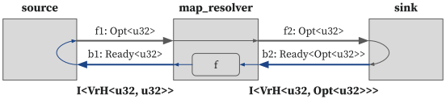
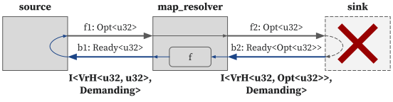
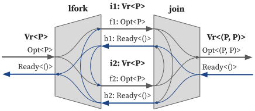

# Dependency Types

We defined the "dependency type" based on the dependency from the backward signal to the forward signal.
The concept was inspired from the [BaseJump STL](https://dl.acm.org/doi/pdf/10.1145/3195970.3199848).

## Motivation: Combinational Loop

The following circuit is constructed by connecting [`source`](../lang/combinator.md#source), [`map_resolver`](../lang/combinator.md#map_resolver), and [`sink`](../lang/combinator.md#sink) combinators.

<p align="center">
  
</p>

```rust,noplayground
fn m() {
    I::<VrH<Opt<u32>, Opt<u32>>>::source()
        .map_resolver::<Opt<u32>>(|p: Ready<Opt<u32>>| p.inner.unwrap_or(0))
        .sink()
}
```

In this circuit, we can consider the dependency between the `f2` and `b2` signals from two perspectives:

- Since the `source` combinator forwards the backward signals to the forward signals and the `map_resolver` combinator preserves the dependencies between its forward and backward signals, there is a dependency `b2 -> b1 -> f1 -> f2`.
- Since the `sink` combinator forwards the forward signals to the backward signals, there is a dependency `f2 -> b2`.

Thus, a cyclic dependency exists between `f2` and `b2`.
This is commonly referred to as a *combinational loop*, which makes the circuit never stabilize and causes the simulator to hang.
A combinational loop occurs when the output of some combinational logic is fed back into the input of that same combinational logic without any intervening register.

## Dependency Types

To prevent combinational loops in circuit design, we use a type system called "Dependency Type".

We categorize interfaces into two kinds of types: `Helpful` and `Demanding`.

- `Helpful`: forward signals does not depend on its backward signals.
- `Demanding`: forward signals depends on its backward signals, and they satisfy the condition that if the payload is `Some`, the ready condition is true.

Based on the above definition, in the motivational circuit, both the interface between `source` and `map_resolver` and the interface between `map_resolver` and `sink` are of the `Demanding` type.

> NOTE: In our type system, we do not consider the case where the forward signals depend on the backward signals, the payload is `Some`, but the ready condition is false.
This case is guaranteed not to occur when the circuit is designed only with the combinator defiend in our standard combinator library.

In HazardFlow, we defined the dependency type as an enum `Dep`:

```rust,noplayground
/// Dependency type of a hazard interface.
#[derive(Debug, Clone, Copy, PartialEq, Eq, PartialOrd, Ord, ConstParamTy)]
enum Dep {
    /// The payload (`Fwd`) does not depend on the resolver (`Bwd`).
    Helpful = 0,

    /// The payload (`Fwd`) depends on the resolver (`Bwd`), and they satisfy the condition that if the payload is
    /// `Some`, `Hazard::ready(p, r)` is true.
    ///
    /// It is a bug to make the payload depend on the resolver but break the condition.
    Demanding = 1,
}
```

and we annotated the dependency type to the hazard interface.

```rust,noplayground
/// Hazard interface.
#[derive(Debug)]
struct I<H: Hazard, const D: Dep>;
```

The benefit of using dependency types is that we can restrict the usage of combinators that introduce a combinational loop, which leads to more productive circuit design.
We will explain more with the example of interface combinators.

## Examples: Types for Interface Combinators

Let's look into the IO type for the interface combinators in the motivational circuit.

### `source`

<p align="center">
  
</p>

```rust,noplayground
impl<P: Copy> I<VrH<P, P>, { Dep::Demanding }> {
    fn source() -> I<VrH<P, P>, { Dep::Demanding }> {
        ().fsm::<I<VrH<P, P>, { Dep::Demanding }>, ()>((), |_, er, _| {
            let ep = if er.ready { Some(er.inner) } else { None };
            (ep, (), ())
        })
    }
}
```

Since the forward signals (`ep`) depend on the backward signals (`er`), its egress interface has a `Demanding` type.
Therefore, it returns an `I<VrH<P, P>, { Dep::Demanding }>`.

### `map_resolver`

<p align="center">
  
</p>

```rust,noplayground
impl<P: Copy, R: Copy, const D: Dep> I<VrH<P, R>, D> {
    fn map_resolver<ER: Copy>(self, f: impl Fn(Ready<ER>) -> R) -> I<VrH<P, ER>, D> {
        self.fsm::<I<VrH<P, ER>, D>, ()>(|ip, er, _| {
            let ep = ip;
            let ir = Ready::new(er.ready, f(er));
            (ep, ir, ())
        })
    }
}
```

The egress forward signals (`ep`) depend on the ingress forward signals (`ip`),
while ingress backward signals (`ir`) depend on the egress backward signals (`er`).
Therefore, if the ingress interface has a `Helpful` type (`ir -/-> ip`),
then the egress interface will also have a `Helpful` type (`er -> ir -/-> ip -> ep`).
Similarly, if the ingress interface has a `Demanding` type, then the egress interface will also have a `Demanding` type.
Consequently, it takes an `I<VrH<P, R>, D>` and returns an `I<VrH<P, ER>, D>`, where `D` can be any type.

### `sink`

<p align="center">
  
</p>


```rust,noplayground
impl<P: Copy> I<VrH<P, Opt<P>>, { Dep::Helpful }> {
    fn sink(self) {
        self.fsm::<(), ()>((), |ip, _, _| {
            let ir = Ready::valid(ip);
            ((), ir, ())
        })
    }
}
```

Since the backward signals (`ir`) depend on the forward signals (`ip`),
a combinational loop occurs when the ingress interface has a `Demanding` type (`ir` -> `ip` -> `ir`).
To prevent this, we only allow the ingress interface to have a `Helpful` type.
Therefore, it takes only `I<VrH<P, Opt<P>>, { Dep::Helpful }>`.

Now let's apply the combinator types introduced above to the motivational circuit.

<p align="center">
  
</p>

The egress interface of `source` combinator is `I<VrH<u32, u32>, { Dep::Demanding }>`,
and the egress interface of `map_resolver` combinator is `I<VrH<u32, Opt<u32>>, { Dep::Demanding }>`.
However, since the `sink` combinator only takes ingress interface of `Helpful` type,
we cannot apply the `sink` combinator to the egress interface of `map_resolver`.
This prevents the occurrence of combinational loops.
To apply the `sink` combinator, we need to change the type to `Helpful` by using combinators like [`reg_fwd`](../lang/combinator.md#reg_fwd).

## Limitations

Currently, a limitation exists in that dependency types cannot capture all types of combinational loops.
This is because dependency types only check for intra-interface dependencies and do not consider for inter-interface dependencies.
The most common example of this is the `fork-join` pattern.

<p align="center">
  
</p>

In the circuit described above, a combinational loop exists with `f1 -> b2 -> f1` and `f2 -> b1 -> f2`.
However, the current type system cannot detect such loops.
For the `lfork` combinator, since there is no dependency from `b1 -> f1` or `b2 -> f2`, if the ingress interface type is `Helpful`, then both egress interface types will also be `Helpful`.

And for the `join` combinator, it is designed to take two `Helpful` ingress interfaces (let's call them `i1` and `i2`) and return a `Helpful` egress interface.
However, a combinational loop occurs if there is a dependency from the backward signals of `i1` to the forward signals of `i2`, or from the backward signals of `i2` to the forward signals of `i1`.

Since the current type system cannot represent inter-interface dependencies, this remains as a limitation.
For now, we expect that these types of combinational loops will be detected by synthesis tools.

<!--
### `filter_map`

It takes an `I<VrH<P, R>, D>` and returns an `I<VrH<EP, R>, D>`.

### `reg_fwd`

It takes an `I<VrH<P, ()>, D>` and returns an `I<VrH<P, ()>, { Dep::Helpful }>`.

### `lfork`

It takes an `I<VrH<P, ()>, D>` and returns two `I<VrH<P, ()>, D>`.

### `join`

It takes `Vr<P1>`, `Vr<P2>` and returns an `Vr<(P1, P2)>`.
-->
