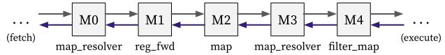

# Decode stage

The decode stage mainly do the following things:

1. Decodes the instruction.
2. Reads the value of source registers.

It can be decomposed into combinators as follows ([code](https://github.com/kaist-cp/hazardflow/blob/main/hazardflow-designs/src/cpu/decode.rs)):

  

## Input and Output

The IO interface type of the decode stage is as follows:

### Ingress

It takes an ingress interface with type `I<VrH<FetEP, DecR>, { Dep::Demanding }>`.

You can check the explanation of `FetEP` and `DecR` in [here](fetch.md#egress).

### Egress

It returns an egress interface with type `I<VrH<DecEP, ExeR>, { Dep::Demanding }>`.

Each of `DecEP` and `ExeR` is defined as a struct with the following fields:

**DecEP** (in [decode.rs](https://github.com/kaist-cp/hazardflow/blob/main/hazardflow-designs/src/cpu/decode.rs)):

- `wb_info`: Writeback information which contains the writeback address and selector.
- `br_info`: Branch information which contains the branch type, target address' base and offset.
- `alu_input`: ALU input.
- `mem_info`: Memory information.
- `csr_info`: CSR information.
- `is_illegal`: Indicates that the instruction is illegal or not.
- `pc`: PC.
- `debug_inst`: Instruction (for debugging purpose).

**ExeR** (in [exe.rs](https://github.com/kaist-cp/hazardflow/blob/main/hazardflow-designs/src/cpu/exe.rs)):

- `bypass_from_exe`: Bypassed data from the execute stage.
- `bypass_from_mem`: Bypassed data from the memory stage.
- `bypass_from_wb`: Bypassed data from the writeback stage.
- `stall`: Destination register address of load or CSR instruction in the execute stage.
- `redirect`: Redirection PC.
- `rf`: Register file.

## Behavior

Each combinator do the following things:

**M0** ([`map_resolver_inner`](https://kaist-cp.github.io/hazardflow/docs/hazardflow_designs/std/hazard/struct.I.html#method.map_resolver_inner)):

- Constructs the ingress resolver of the decode stage.

**M1** ([`reg_fwd`](https://kaist-cp.github.io/hazardflow/docs/hazardflow_designs/std/hazard/struct.I.html#method.reg_fwd)):

- Creates a pipelined stage before decoding the instruction.
- Sends a ready signal which indicates it will be free in the next cycle.

**M2** ([`map`](https://kaist-cp.github.io/hazardflow/docs/hazardflow_designs/std/hazard/struct.I.html#method.map-1)):

- Decodes the instruction.

**M3** ([`map_resolver_block`](https://kaist-cp.github.io/hazardflow/docs/hazardflow_designs/std/hazard/struct.I.html#method.map_resolver_block)):

- Stalls until the value of source registers are visible.

**M4** ([`filter_map_drop_with_r`](https://kaist-cp.github.io/hazardflow/docs/hazardflow_designs/std/hazard/struct.I.html#method.filter_map_drop_with_r)):

- Reads the value of source registers and attaches them to the payload.
- Filters out the payload when the redirection happens.

<!--

  

**Calculate Ingress Resolver for Fetch Stage**

* Calculate the resolver from decode stage to fetch stage.
* Resolvers from later stages will be used here to calculate `pc_sel` and `if_kill`

  

**Store The Instruction Memory Response and Decode The Instruction**

* We store the `imem` response into the latch.
* We decode the current `imem` response and calculate the instruction.

  

**Stall the Payload and Pass Back The Instruction**

* We need to stall the payload if certain certain hazards happen.
* We need to pass back the decoded instruction to previous combinators for calculating resolver.

  

**Calculate the Egress Payload for Execution Stage**

* Calculate the payload for execution stage.
* Drop the payload if certain hazards happen.

  

-->
