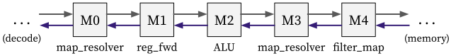

# Execute stage

The execute stage mainly do the following things:

1. Executes the ALU.
2. Resolves the branch misprediction.

It can be decomposed into combinators as follows ([code](https://github.com/kaist-cp/hazardflow/blob/main/hazardflow-designs/src/cpu/exe.rs)):

  

## Input and Output

The IO interface type of the execute stage is as follows:

### Ingress

It takes an ingress interface with type `I<VrH<DecEP, ExeR>, { Dep::Demanding }>`.

You can check the explanation of `DecEP` and `ExeR` in [here](decode.md#egress).

### Egress

It returns an egress interface with type `I<VrH<ExeEP, MemR>, { Dep::Demanding }>`.

Each of `ExeEP` and `MemR` is defined as a struct with the following fields:

**ExeEP** (in [exe.rs](https://github.com/kaist-cp/hazardflow/blob/main/hazardflow-designs/src/cpu/exe.rs)):

- `wb_info`: Writeback information which contains the writeback address and selector.
- `alu_out`: ALU output.
- `mem_info`: Memory information.
- `csr_info`: CSR information.
- `is_illegal`: Indicates that the instruction is illegal or not.
- `pc`: PC.
- `debug_inst`: Instruction (for debugging purpose).

**MemR** (in [mem.rs](https://github.com/kaist-cp/hazardflow/blob/main/hazardflow-designs/src/cpu/mem.rs)):

- `bypass_from_mem`: Bypassed data from the memory stage.
- `bypass_from_wb`: Bypassed data from the writeback stage.
- `redirect`: Redirection PC.
- `rf`: Register file.

## Behavior

Each combinator do the following things:

**M0** ([`map_resolver_inner`](https://kaist-cp.github.io/hazardflow/docs/hazardflow_designs/std/hazard/struct.I.html#method.map_resolver_inner)):

- Resolves the branch misprediction based on the branch type and ALU output.
- Constructs the ingress resolver of the execute stage.
  + Attaches the bypassed data, stall, and redirection PC for resolving data hazards.

**M1** ([`reg_fwd`](https://kaist-cp.github.io/hazardflow/docs/hazardflow_designs/std/hazard/struct.I.html#method.reg_fwd)):

- Creates a pipelined stage before executing the ALU.
- Sends a ready signal which indicates it will be free in the next cycle.

**M2** ([`map`](https://kaist-cp.github.io/hazardflow/docs/hazardflow_designs/std/hazard/struct.I.html#method.map-1)):

- Executes the ALU.

**M3** ([`map_resolver_block_with_p`](https://kaist-cp.github.io/hazardflow/docs/hazardflow_designs/std/hazard/struct.I.html#method.map_resolver_block_with_p)):

- Attaches the ALU output to the resolver signal for the redirection PC calculation.
- Stalls until the data hazards have been resolved.

**M4** ([`filter_map_drop_with_r_inner`](https://kaist-cp.github.io/hazardflow/docs/hazardflow_designs/std/hazard/struct.I.html#method.filter_map_drop_with_r_inner)):

- Attaches the ALU output to the payload.
- Filters out the payload when the redirection happens.

<!--
The execution stage executes instruction from the decode stage,
calculates the payload passing to the memory stage,
and also calculates the resolver passing to the decode stage.

* The ingress payload is decode stage's egress payload `DecEP`.
* The ingress resolver is the resolvers from execute stage and later stages `(exe_r, mem_r, wb_r)`.
* The egress payload should contain necessary information for the memory stage `exe_ep`.
* The egress resolver contains the resolver from memory stage and write-back stage `(mem_r, wb_r)`.

**Calculate Ingress Resolver for Decode Stage**

* Calculate the execution stage resolver and pass it with `mem_r` and `wb_r` to the decode stage.

  

**Store the Decode Stage Egress Payload**

* Store the `dec_ep` into register for passing back to previous combinators for calculating `exe_r`.

  

**Execute The Instruction**

* Execute the instruction and pass the `alu_out` to the next combinator.

  

**Stall The Payload and Pass Back The Result of ALU**

* We need to stall the payload if certain certain hazards happen.
* We need to pass back the result of ALU `alu_out` to previous combinators for calculating resolver.

  

**Calculate The Payload For Memory Stage**

* Calculate the payload for the memory stage.
* Drop the payload if certain hazards happen.

  

-->
