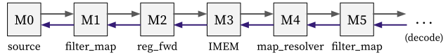

# Fetch stage

The fetch stage mainly do the following things:

1. Calculates the next PC for the upcoming instruction.
2. Accesses IMEM to retrieve the instruction bytecode.

It can be decomposed into combinators as follows ([code](https://github.com/kaist-cp/hazardflow/blob/main/hazardflow-designs/src/cpu/fetch.rs)):

  

## Input and Output

The IO interface type of the fetch stage is as follows:

### Ingress

This is the first stage, it does not take any ingress interface.

### Egress

It returns an egress interface with type `I<VrH<FetEP, DecR>, { Dep::Demanding }>`.

Each of `FetEP` and `DecR` is defined as a struct with the following fields:

**FetEP** (in [fetch.rs](https://github.com/kaist-cp/hazardflow/blob/main/hazardflow-designs/src/cpu/fetch.rs)):

- `imem_resp`: IMEM response which contains the address (PC) and the data (inst bytecode).

**DecR** (in [decode.rs](https://github.com/kaist-cp/hazardflow/blob/main/hazardflow-designs/src/cpu/decode.rs)):

- `redirect`: Represents the redirection PC when the control hazard occurs.

## Behavior

Each combinator do the following things:

**M0** ([`source_drop`](https://kaist-cp.github.io/hazardflow/docs/hazardflow_designs/std/hazard/struct.I.html#method.source_drop)):

- Forwards the current IMEM response and the redirection PC from the resolver to the payload.

**M1** ([`filter_map`](https://kaist-cp.github.io/hazardflow/docs/hazardflow_designs/std/hazard/struct.I.html#method.filter_map-1)):

- Calculates the next PC based on the incoming payload.
  + If the redirection PC exists, go to it.
  + Otherwise, go to the next sequential address (PC + 4).

**M2** ([`reg_fwd_with_init`](https://kaist-cp.github.io/hazardflow/docs/hazardflow_designs/std/hazard/struct.I.html#method.reg_fwd_with_init)):

- Creates a pipelined stage before accessing IMEM by storing the next PC in a register.
- When the circuit is reset, it is initialized with the designated start address (`START_ADDR`).

**M3** ([`map`](https://kaist-cp.github.io/hazardflow/docs/hazardflow_designs/std/hazard/struct.I.html#method.map-1) + [`comb`](https://kaist-cp.github.io/hazardflow/docs/hazardflow_designs/std/interface/trait.Interface.html#method.comb) + [`map`](https://kaist-cp.github.io/hazardflow/docs/hazardflow_designs/std/hazard/struct.I.html#method.map-1)):

- Constructs the IMEM request with `map` combinator.
- Accesses the external IMEM module to fetch the instruction bytecode with `comb` combinator.
  + We use an asynchronous memory for memory, it provide the response in the same cycle.
  + We used [`attach_resolver`](https://kaist-cp.github.io/hazardflow/docs/hazardflow_designs/std/valid_ready/fn.attach_resolver.html) module combinator to attach additional resolver to the IMEM.
- Deconstructs the IMEM response with `map` combinator.

**M4** ([`map_resolver_drop_with_p`](https://kaist-cp.github.io/hazardflow/docs/hazardflow_designs/std/hazard/struct.I.html#method.map_resolver_drop_with_p)):

- Attaches the IMEM response to the resolver signal for the next PC calculation.
- Turns on the ready signal when control hazard occurs to extract the payload from **M2**.

**M5** ([`filter_map_drop_with_r_inner`](https://kaist-cp.github.io/hazardflow/docs/hazardflow_designs/std/hazard/struct.I.html#method.filter_map_drop_with_r_inner)):

- Filters out the payload when the redirection happens.

<!--

  

  

  

-->
