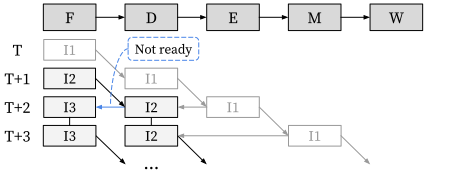
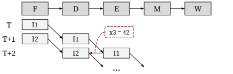
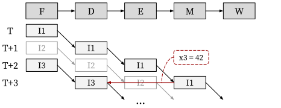
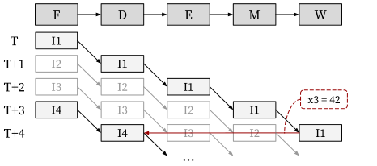
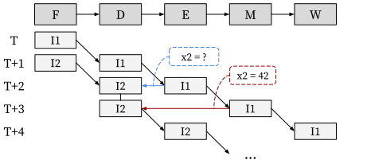
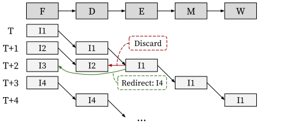
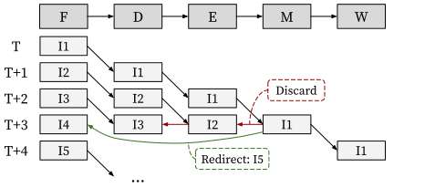

# Hazards

In this section, we will explain the hazards that can occur in our baseline CPU.

The hazards could be classified into: *[structural](#structural-hazards)*, *[data](#data-hazards)*, and *[control](#control-hazards)*.

## Structural Hazards

Structural hazard occurs when multiple pipeline stages need to access the same hardware resource such as memory, register file, and arithmetic logic unit (ALU) at the same clock cycle.
It should be resolved by *stalling* the stage which trying to access later:

### Solution: Stall

```armasm
I1:  sub  x4, x3, x2  # read from x2 requires several cycle in the decode stage
I2:  add  x4, x3, x2  # need to wait in the fetch stage
```

<p align="center">
  
</p>

In the example above, suppose that `I1` has to wait several cycles in the decode stage to read the value of `x2` (you can find the example [here](#from-the-load-instruction)).

As a result, structural hazard occurs at cycle T+1 because `I2` is ready to move to the decode stage while `I1` still needs to occupy the decode stage.
To resolve this hazard, the decode stage asks `I2` to stall at cycle T+1.
It is usually done by turning off the ready bit in the [valid-ready protocol](../../lang/interface.md#motivation-handshake).

## Data Hazards

Data hazard occurs when the processing of a pipeline stage depends on the result of later stages.
It should be resolved by *stalling* the stage if its data dependency is not made available yet;
or *bypassing* the necessary data from later stages in the same clock cycle.

For instance, a data hazard due to read-after-write dependency in CPU core is resolved either by stall the read instruction in the decode stage or by bypassing the result of the write instruction in the later stages to the read instruction in the decode stage.

### Solution (1/2): Bypassing

In the decode stage, we need to read the value of source registers.
When the RAW dependency happens, we can *bypass* the values from the later stages to the decode stage.

#### From the execute stage:

```armasm
I1:  add  x3, x2, x1  # write to x3
I2:  sub  x5, x4, x3  # read from x3
```

<p align="center">
  
</p>

At cycle T+2, `I1` can bypass the value of `x3` to the `I2`.

#### From the memory stage:

```armasm
I1:  add  x3, x2, x1  # write to x3
I2:  nop
I3:  sub  x5, x4, x3  # read from x3
```

<p align="center">
  
</p>

At cycle T+3, `I1` can bypass the value of `x3` to the `I3`.

<!-- - When `I1` is in the execution stage, `I2` is still in decode stage, and [load-use stall](#load-use-stall) will happen.
- When `I1` reaches the memory stage, `I2` is still in the decode stage.
- When `I1` gets the value of `x3` from memory, the memory stage can bypass the value of `x3` to the `I2` in decode stage. -->

#### From the writeback stage:

```armasm
I1:  add  x3, x2, x1  # write to x3
I2:  nop
I3:  nop
I4:  sub  x5, x4, x3  # read from x3
```

<p align="center">
  
</p>

At cycle T+4, `I1` can bypass the value of `x3` to the `I4`.

<!-- - When `I1` reaches write-back stage, `I4` is in decode stage.
- Write-back stage can bypass the value of `x3` to `I4` in decode stage. -->

### Solution (2/2): Stall

When data from a later stage is not yet ready, bypassing is not possible, and a stall becomes necessary.
In our baseline CPU, there are two sources of stall: load instruction, and CSR instruction.

#### From the load instruction:

```armasm
I1:  lw   x2, 0(x1)   # write to x2
I2:  sub  x4, x3, x2  # read from x2
```

<p align="center">
  
</p>

- At cycle T+2, `I2` need to be stalled at the decode stage because `I1` did not reach the memory.
- At cycle T+3, `I1` gets the value of `x2` from the memory, now can bypass the value to the `I2`.

<!-- n I1 to an arithmetic instruction
I2. Here, I2 would read from register r2 at the decode stage at 푇 + 2, but r2 is going to be changed
by I1 in the writeback stage at 푇 + 4. To resolve this hazard, I2 should be stalled at 푇 + 2 because
the correct value of r2 is not loaded from the memory yet. But at 푇 + 3, I2 can be decoded by
bypassing the load result from the memory stage to the decode stage. -->

#### From the CSR instruction:

<!--
The CSR could write its response to certain registers.
If we need to decode the value of those registers in the decode stage,
then we need to stall the instruction in the decode stage until the response coming back from the CSR in the memory stage.
-->

```armasm
I1:  csrr  x2, mcause    # write to x2
I2:  bgez  x2, 8000003c  # read from x2
```

<p align="center">
  
</p>

In our baseline CPU, the CSR is located in the memory stage.

- At T+2, `I2` need to be stalled at the decode stage becuase `I1` did not reach the CSR.
- At T+3, `I1` gets the value of `x2` from the CSR, now can bypass the value to the `I2`.

<!--
- The branch instruction `I3` needs to read the value of registers `t0` and `t1` in the decode stage.
- The value of `t0` is coming from the CSR, which is located in the memory stage. 
- The branch instruction need to be stalled when the CSR instruction is in the execute stage. 
- The value of `t0` will be bypassed from memory stage.

* At cycle 4, the execution resolver stalls the payload in decode stage.
* At cycle 5, the value of `t0` will be bypassed to the decode stage from memory stage.
-->

## Control Hazards

Control hazard occurs when a pipeline stage makes wrong predictions on which instructions to execute in the next clock cycle.
It should be resolved, e.g., when the execute stage detects a misprediction, by *discarding* the mispredicted instructions at the fetch and decode stages and *restarting* from the correct next instruction.

### Solution: Discarding and Restarting

In our baseline CPU, there are two sources of control hazard: branch misprediction and exception.

#### Branch Misprediction

```armasm
I1:  beq  x2, x1, target  # mispredicted to not taken
I2:  add  x5, x4, x3      # should be killed
I3:  lw   x5, 0(x4)       # should be killed

target:
I4:  sub  x5, x4, x3      # correct target address
```

<p align="center">
  
</p>

At cycle T+1, the fetch stage speculates that `I1`'s next instruction is `I2` so that it is fetched from the instruction memory.
But at cycle T+2, the execute stage deduces that `I1`'s next instruction is in fact `I4`.
As such, the mispredicted instructions `I2` and `I3` are discarded at cycle T+2, and the fetch stage is restarted with the correct next instruction `I4` at cycle T+3.

#### Exception

```armasm
I1:  unimp            # illegal instruction, redirect to trap vector
I2:  add  x4, x3, x2  # should be killed
I3:  sub  x4, x3, x2  # should be killed
I4:  lw   x4, 0(x3)   # should be killed

trap_vector:
I5:  csrr x5, mcause  # trap handling logic
```

<p align="center">
  
</p>

The illegal instruction `I1` generates the exception and should be redirected to the trap vector to handle the exception.
At cycle T+3, the illegal instruction `I1` reaches the CSR in the memory stage, and it returns the trap vector address.
As such, the mispredicted instructions `I2`, `I3`, and `I4` are discarded at cycle T+3, and the fetch stage is restarted with the correct next instruction `I5` at cycle T+4.

<!--
## 5-Stage Overview

* Fetch: Retrieve the next instruction to be executed from the instruction memory.
* Decode: Decode the fetched instruction.
* Execution: Perform the operation specified by the instruction.
* Memory: Access data memory or CSR if the instruction involves memory operations or CSR operation.
* Write-Back: Write the result of the execution, memory access, or CSR access back to the register file.

### Pipelining (w/o Hazard)

The ideal pipelined design works like the following figure if there is no dependency between the instructions.

<p align="center">
  
</p>

### Pipelining (w/ Hazard)

However, most of the time, there are some dependencies between instructions.
The later stages need to send back resolvers to the earlier stages to make sure the execution result is correct.
The resolvers might cause the early stages to stall or extract the payload out of their latches and drop their payloads (kill).
-->
