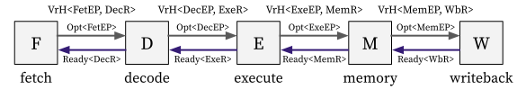

# Implementation

With the existence of hazards, the 5-stage pipelined CPU core can be decomposed as follows:

<p align="center">
  
</p>

with the following implementation ([riscv32_5stage.rs](https://github.com/kaist-cp/hazardflow/blob/main/hazardflow-designs/src/cpu/riscv32_5stage.rs)):

```rust,noplayground
const START_ADDR: u32 = 0x80000000;

fn core(
    imem: impl FnOnce(Vr<MemReq>) -> Vr<MemRespWithAddr>,
    dmem: impl FnOnce(Vr<MemReq>) -> Vr<MemRespWithAddr>,
) {
    fetch::<START_ADDR>(imem)
        .comb(decode)
        .comb(exe)
        .comb(move |i| mem(i, dmem))
        .comb(wb)
}
```

- `imem` and `dmem` are modules for instruction memory and data memory, respectively.
- We chain the 5 sub-modules `fetch`, `decode`, `exe`, `mem`, and `wb` by using the `comb` method.

In the following subsections, we will explain the implementation details for each stage.

<!--
**Fetch stage:**

TODO(@minseong): Figure

```rust,noplayground
pub fn fetch<const START_ADDR: u32>(
    imem: impl FnOnce(Vr<MemReq>) -> Vr<MemRespWithAddr>,
) -> I<VrH<FetEP, DecR>, { Dep::Demanding }> {
    ..
}
```

**Decode stage:**

TODO(@minseong): Figure

```rust,noplayground
pub fn decode(
    i: I<VrH<FetEP, DecR>, { Dep::Demanding }>
) -> I<VrH<DecEP, (ExeR, MemR, WbR)>, { Dep::Demanding }> {
    ..
}
```

**Execute stage:**

TODO(@minseong): Figure

```rust,noplayground
pub fn exe(
    i: I<VrH<DecEP, (ExeR, MemR, WbR)>, { Dep::Demanding }>
) -> I<VrH<ExeEP, (MemR, WbR)>, { Dep::Demanding }> {
    ..
}
```

**Memory stage:**

TODO(@minseong): Figure

```rust,noplayground
/// Memory stage.
pub fn mem(
    i: I<VrH<ExeEP, (MemR, WbR)>, { Dep::Demanding }>,
    dmem: impl FnOnce(Vr<MemReq>) -> Vr<MemRespWithAddr>,
) -> I<VrH<MemEP, WbR>, { Dep::Demanding }> {
    ..
}
```

**Writeback stage:**

TODO(@minseong): Figure

```rust,noplayground
pub fn wb(i: I<VrH<MemEP, WbR>, { Dep::Demanding }>) {
    ..
}
```
-->
