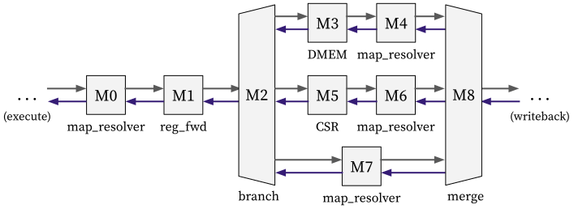

# Memory stage

The memory stage mainly do the following things:

1. Accesses memory for load/store instructions.
2. Accesses CSR for illegal instruction and CSR instructions.

It can be decomposed into combinators as follows ([code](https://github.com/kaist-cp/hazardflow/blob/main/hazardflow-designs/src/cpu/mem.rs)):

  

## Input and Output

The IO interface type of the memory stage is as follows:

### Ingress

It takes an ingress interface with type `I<VrH<ExeEP, MemR>, { Dep::Demanding }>`.

You can check the explanation of `ExeEP` and `MemR` in [here](exe.md#egress).

### Egress

It returns an egress interface with type `I<VrH<MemEP, WbR>, { Dep::Demanding }>`.

Each of `MemEP` and `WbR` is defined as a struct with the following fields:

**MemEP** (in [mem.rs](https://github.com/kaist-cp/hazardflow/blob/main/hazardflow-designs/src/cpu/mem.rs)):

- `wb_info`: Writeback information which contains the writeback address and data.
- `debug_pc`: PC (for debugging purpose).
- `debug_inst`: Instruction (for debugging purpose).

**WbR** (in [wb.rs](https://github.com/kaist-cp/hazardflow/blob/main/hazardflow-designs/src/cpu/wb.rs)):

- `bypass_from_wb`: Bypassed data from the writeback stage.
- `rf`: Register file.

## Behavior

Each combinator do the following things:

**M0** ([`map_resolver_inner`](https://kaist-cp.github.io/hazardflow/docs/hazardflow_designs/std/hazard/struct.I.html#method.map_resolver_inner)):

- Constructs the ingress resolver of the memory stage.
  + Attaches the bypassed data and redirection PC for resolving data hazards.

**M1** ([`reg_fwd`](https://kaist-cp.github.io/hazardflow/docs/hazardflow_designs/std/hazard/struct.I.html#method.reg_fwd)):

- Creates a pipelined stage before accessing DMEM or CSR.
- Sends a ready signal which indicates it will be free in the next cycle.

**M2** ([`map`](https://kaist-cp.github.io/hazardflow/docs/hazardflow_designs/std/hazard/struct.I.html#method.map-1) + [`branch`](https://kaist-cp.github.io/hazardflow/docs/hazardflow_designs/std/hazard/struct.I.html#method.branch-14)):

- Computes the branch selector with `map` combinator.
- Branches the interface into three for accessing different module (DMEM / CSR / None).
<!-- - While select one of the payload to transfer, it combines all the resolvers into the ingress. -->

**M3** ([`map`](https://kaist-cp.github.io/hazardflow/docs/hazardflow_designs/std/hazard/struct.I.html#method.map-1) + [`comb`](https://kaist-cp.github.io/hazardflow/docs/hazardflow_designs/std/interface/trait.Interface.html#method.comb)):

- Constructs DMEM request with `map` combinator.
- Accesses the external DMEM module with `comb` combinator.
  + We use an asynchronous memory for memory, it provide the response in the same cycle.
  + We used [`attach_resolver`](https://kaist-cp.github.io/hazardflow/docs/hazardflow_designs/std/valid_ready/fn.attach_resolver.html) and [`attach_payload`](https://kaist-cp.github.io/hazardflow/docs/hazardflow_designs/std/valid_ready/fn.attach_payload.html) to attach additional resolver/payload to the DMEM.

**M4** ([`map_resolver_with_p`](https://kaist-cp.github.io/hazardflow/docs/hazardflow_designs/std/hazard/struct.I.html#method.map_resolver_with_p-1) + [`map`](https://kaist-cp.github.io/hazardflow/docs/hazardflow_designs/std/hazard/struct.I.html#method.map-1)):

- Attaches the DMEM response to the resolver signal for the bypassing data calculation.
- Constructs the memory stage egress payload with `map` combinator.

**M5** ([`map`](https://kaist-cp.github.io/hazardflow/docs/hazardflow_designs/std/hazard/struct.I.html#method.map-1) + [`comb`](https://kaist-cp.github.io/hazardflow/docs/hazardflow_designs/std/interface/trait.Interface.html#method.comb)):

- Constructs CSR request with `map` combinator.
- Accesses the CSR module with `comb` combinator.
  + It provide the response in the same cycle.

**M6** ([`map_resolver_with_p`](https://kaist-cp.github.io/hazardflow/docs/hazardflow_designs/std/hazard/struct.I.html#method.map_resolver_with_p-1) + [`map`](https://kaist-cp.github.io/hazardflow/docs/hazardflow_designs/std/hazard/struct.I.html#method.map-1)):

- Attaches the CSR response to the resolver signal for the bypassing data calculation.
  + It contains the redirection PC when exception happens.
- Constructs the memory stage egress payload with `map` combinator.

**M7** ([`map_resolver_with_p`](https://kaist-cp.github.io/hazardflow/docs/hazardflow_designs/std/hazard/struct.I.html#method.map_resolver_with_p-1) + [`map`](https://kaist-cp.github.io/hazardflow/docs/hazardflow_designs/std/hazard/struct.I.html#method.map-1)):

- Directly attaches the payload to the resolver signal bypassing data calculation.
- Constructs the memory stage egress payload with `map` combinator.

**M8** ([`merge`](https://kaist-cp.github.io/hazardflow/docs/hazardflow_designs/std/combinators/merge/trait.MergeExt.html#impl-MergeExt%3CN,+%7B+Dep::Demanding+%7D%3E-for-%5BI%3CAndH%3CH%3E,+D%3E;+N%5D)):

- Selects one of transferrable egress interface of **M4** (DMEM), **M6** (CSR), and **M7** (None).
  + It is guaranteed to be processed in-order manner because the maximum concurrent instruction in the memory stage is limited to one.

<!--
The memory stage sends the requests to the memory `dmem` module and the CSR module according to the instruction types. 
When the memory stage gets the response from `dmem` or CSR, it will calculate the egress payload of the memory stage and send the payload to the write-back stage.
Also, the memory stage will calculate its resolver from the response from `dmem` and CSR and send it back to the execution stage.

**Store The Execution Stage Egress Payload and Filter out Unnecessary Information**

* Store the `exe_ep` into the latch to create a pipeline
* Filter out the unnecessary information and pass the resolver to execution stage.

  

**Calculate The Resolver For Execution Stage**

* Clear up the resolver from later combinators.
* Calculate the resolver for the execution stage.

  

  

Split the ingress interface into three egress interfaces

  

**Calculate The Memory Request and Request The Memory Module**

* The memory module's egress resolver ready signal is `false` until the memory module gets the data from memory.
* The memory module might take multiple cycles to find the desired data if data cache miss happens.
* If data cache miss happens, certain instructions in other stages need to be stalled.

  

**Calculate The CSR Request and Request The CSR Module**

* In RISC-V, handling exceptions and interrupts involves setting up the exception vectors and managing the states when exceptions occur. Here are relevant instructions and registers:
* CSR provides the exception and interrupt handler `evec`.
* CSR provides the state of the program to continue execution after handling the exception `eret`.

  

**Pass Back The Execution Egress Payload To Earlier Combinators**

* The earlier combinator needs the egress payload `exe_ep` for calculating the memory stage's resolver.
* We pass the `exe_ep` back in each branch.

  

**Formatting The Ingress Interfaces For Merge**

* To merge the three branches, we need to format the ingress interfaces.
* For the fields which is not in the ingress payload, we simply set it as `None`.

  

  

**Calculate The Egress Payload of Memory Stage**

* Calculate the egress payload of memory stage and pass it to the write-back stage

  

-->
