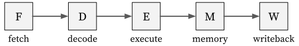

# CPU Core (5-Stage Pipelined)

Our baseline CPU implements the RV32I+Zicsr ISA using a 5-stage pipelined design.
It is based on the [riscv-sodor](https://github.com/ucb-bar/riscv-sodor) processor developed by Berkeley, with slight modifications.

## Overview: Pipelined Design

The 5-stage pipelined CPU core would ideally be decomposed as follows:

<p align="center">
  
</p>

At a high level, each stage performs the following tasks:

- **Fetch**: Computes the next PC and fetches the instruction bytecode from memory.

- **Decode**: Decodes the bytecode and reads the value of source registers.

- **Execute**: Performs arithmetic and bitwise operations based on the instruction.

- **Memory**: Accesses memory for load/store instructions.

- **Writeback**: Writes the result back to the destination register.

### Example: `lw` instruction

Let's consider the following program with next PC was computed as `0x8000012c` in the fetch stage.

By the previous `auipc` and `addi` instructions, the value of `x3` becomes `0x80002000`, which is the start address of the data section (we omit the details of `auipc` and `addi` instructions here).

```text
Disassembly of section .text:

...
80000124:  00002197  auipc  x3, 0x2       # x3 <- 80002124
80000128:  edc18193  addi   x3, x3, -292  # x3 <- 80002000
8000012c:  0040a703  lw	    x4, 4(x3)     # x4 <- mem[x3+4]
...

Disassembly of section .data:

...
80002004:  deadbeef
...
```

Then the `lw` instruction will be processed in each stage as follows:

- **Fetch**: Accesses memory with the next PC `0x8000012c` and fetch the bytecode `0x0040a703`.

- **Decode**:

  + Decodes the bytecode `0x0040a703`. It contains the operations in the later stages:

    + In the execute stage, computes the memory access address `x3 + 4`.
    + In the memory stage, loads data from the memory with the computed address.
    + In the writeback stage, writes the load data to the destination register `x4`.

  + Reads the value of the source register `x3` (= `0x80002000`).

- **Execute**: Computes the memory access address `x3 + 4` (= `0x80002004`).

- **Memory**: Accesses the memory with address `0x80002004` and get the data `0xdeadbeef`.

- **Writeback**: It writes the data `0xdeadbeef` to the `x4`.

---

It is quite intuitive, but it becomes more complex due to hazards between pipeline stages.

We will look deeper into hazards and their handling in the following subsections.

<!--
**Payload:**

* Each stage calculates its payload every clock cycle.
* Payloads flow horizontally from left to right through the stages.
* Payload will be passed to the next stage in the next clock cycle.
* Payload might get dropped (not passing to the next stage) because of hazards from later stages.
* Payload might get stalled (stay in the same stage) because of hazards from later stages.
* Payload might receive data from later stages' hazards and get updated before passing to the next stage.
* Payload sending to the next stage contains the necessary information for the next stage to calculate its payload, resolver, and update its state.

**Resolver:**

* Each stage calculates its resolver every clock cycle.
* Resolver flows horizontally from right to left through the stages.
* Resolver passes to the earlier stages within the same clock cycle.
* Resolvers from later stages contains the necessary information for the previous stages to construct their payloads and resolvers.

**State:**

* Each stage keeps its state in some registers (A.K.A latches).
* The state in each stage might be coming from 3 different sources:
  * The payload from the previous stage (decode, execution, memory).
  * The resolver from the earlier stage (fetch).
  * The stage maintains its state (register file in write-back stage).
* The state can be used to calculate the payload or resolver within each stage.
* State might get extracted out of the registers and not pass to the next stage as a payload (get dropped) because of hazards from later stages.
-->

<!--
## Pipelined Design

Pipelined design can improve the overall processor performance with the trade-off of adding design complexity.

- The overall performance is improved by breaking down the critical path into multiple stages, while multiple instructions are processing **simultaneously** at different stages.
* The design complexity comes from the necessity of **hazard** from the later stages to the earlier stages to make sure the execution result is correct. 
-->
