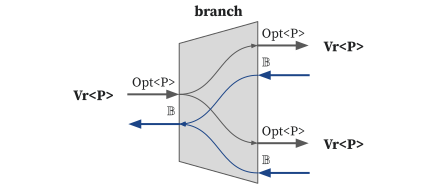

# Interface Combinators

We can chain two interfaces by using combinators.
We define a combinator as a method within each hazard interface.
The combinator specifies the combinational logic of calculating the egress interface payload, ingress interface resolver, and the next state of the combinator.

Note that in this section, you will see the dependency type `D` in the combinators' signature, for more information about the dependency, please refer to the [dependency section](../advanced/dependency.md).

## Generic FSM Combinator

The essence of the interface combinator is the generic `fsm` combinator.

<!-- * The `fsm` function is the idiomatic mechanism to chain two interfaces in HazardFlow HDL.
* This function takes the initial state of the combinator, an anonymous function that calculates the egress interface payload, and ingress interface resolver, as well as the state transition logic, and returns the egress interface.
* We assume the combinational logic of calculating the egress interface payload and ingress interface resolver is calculated every cycle. -->

<p align="center">
  
</p>

We provide the `fsm` combinator that transforms the ingress interface to egress interface with finite state machine.
With this combinator, you can represent an arbitrary FSM.

```rust,noplayground
pub trait Interface: Sized {
    type Fwd: Copy;
    type Bwd: Copy;

    fn fsm<E: Interface, S: Copy>(
        self,
        init_state: S,
        f: impl Fn(Self::Fwd, E::Bwd, S) -> (E::Fwd, Self::Bwd, S),
    ) -> E {
        .. // compiler magic
    }

    ..
}
```

It accepts two arguments which are the FSM's initial state and the combinational logic.

We represent the combinational logic as a function (`f`). It takes three input signals:

- Ingress interface's forward signal (`Self::Fwd`)
- Egress interface's backward signal (`E::Bwd`)
- Current state (`S`)

and returns three output signals:

- Egress interface's forward signal (`E::Fwd`)
- Ingress interface's backward signal (`Self::Bwd`)
- Next state (`S`)

## Standard Combinator Library

We provide standard combinator library for developers to facilitate their work.
We can roughly categorize the library into the following categories.

| Category    | Description                                                                 |
| ----------- | --------------------------------------------------------------------------- |
| Mapping     | Maintains the 1-to-1 relation between the ingress/egress interface.         |
| 1-to-N      | Splits the ingress interface into multiple egress interfaces.               |
| N-to-1      | Merges multiple ingress interfaces into one egress interface.               |
| Register    | Stores the state into registers and could delay for one or multiple cycles. |
| Source/sink | Generates or consumes the interface.                                        |
| FSM         | Runs a finite state machine with an internal state.                         |
| Conversion  | Converts ingress hazard interface into egress hazard interface.             |

For more details about all combinators, please refer to the [rustdoc](TODO).

### Mapping

These combinators either transform the payload (ingress to egress) or transform the resolver (egress to ingress).

We demonstrate the two most representative combinators: `filter_map` and `map_resolver`.

#### `filter_map`

As the name suggested, `filter_map` combinator has the functionality of `filter` and `map`.
It filters out the payload not satisfying certain conditions and transforms the ingress payload `P` to egress payload `EP`.
We demonstrate the `filter_map` which takes `Vr<P>` and returns `Vr<EP>`.

<p align="center">
  
</p>

It can be implemented with using `fsm` combinator like this:

```rust,noplayground
impl<P: Copy> Vr<P> {
    fn filter_map<EP: Copy>(self, f: impl Fn(P) -> HOption<EP>) -> Vr<EP> {
        self.fsm::<Vr<EP>, ()>(|ip, er, _| {
            let (ep, ir) = (ip.and_then(f), er);
            (ep, ir, ())
        })
    }
}
```

It is stateless, and egress transfer happens when (1) ingress transfer happens, and (2) `f` returns `Some` with given ingress payload.

For example, let's consider the following `f`:

```rust,noplayground
fn f(i: u32) -> HOption<bool> {
    if i == 0 {
        // If `i` is zero, filters out the payload.
        None
    } else if i & 1 == 0 {
        // If `i` is even number, returns `true`.
        Some(true)
    } else {
        // If `i` is odd number, returns `false`.
        Some(false)
    }
}
```

Then the cycle-level behavior of `filter_map` is as follows:

<p align="center">
  
</p>

<!--
{
  signal: [
    {name: 'clk', wave: 'p.....'},
    {},
    ['ingress',
      ['fwd',
        {name: 'valid', wave: '1..0.1'},
        {name: 'payload', wave: '34.x.5', data: ['42','0','3']},
      ],
      ['bwd',
        {name: 'ready', wave: '101010'},
      ]
    ],
    {},
    ['egress',
      ['fwd',
        {name: 'valid', wave: '10...1'},
        {name: 'payload', wave: '3x...5', data: ['T','F']},
      ],
      ['bwd',
        {name: 'ready', wave: '101010'},
      ]
    ]
  ],
  head: {
    tock:0,
    every:1
  }
}
-->

<!--
| cycle | ip         | er  | ep                | ir  |
| ----- | ---------- | --- | ----------------- | --- |
| 0     | `Some(42)` | `T` | `f(42) = Some(T)` | `T` |
| 1     | `Some(0)`  | `F` | `f(0) = None`     | `F` |
| 2     | `Some(0)`  | `T` | `f(0) = None`     | `T` |
| 3     | `None`     | `F` | `None`            | `F` |
| 4     | `None`     | `T` | `None`            | `T` |
| 5     | `Some(3)`  | `F` | `f(3) = Some(F)`  | `F` |
-->

(`T` and `F` means `true` and `false`, respectively)

- Cycle 0: transfer happens both at ingress and egress side.
- Cycle 2: transfer happens at ingress side, but it was filtered out by `f`.
- Cycle 5: transfer does not happens because egress is not ready to receive.

Note that `filter_map` can work with ingress interfaces `I<VrH<P, R>, D>`, `I<ValidH<P, R>, D>` and `I<H, D>` and there are variants of the `filter_map` like `filter_map_drop_with_r`.

#### `map_resolver`

This combinator transforms the egress resolver to the ingress resolver and leaves the payload untouched.
We demonstrate the `map_resolver` with ingress interface `I<VrH<P, R>, D>`. Similar to `filter_map`, `map_resolver` has other variants and can also work with other ingress interfaces.

<p align="center">
  
</p>

```rust,noplayground
impl<P: Copy, R: Copy, const D: Dep> I<VrH<P, R>, D> {
    fn map_resolver<ER: Copy>(self, f: impl Fn(Ready<ER>) -> R) -> I<VrH<P, ER>, D> {
        self.fsm::<I<VrH<P, ER>, D>, ()>(|ip, er, _| {
            let ep = ip;
            let ir = Ready::new(er.ready, f(er));
            (ep, ir, ())
        })
    }
}
```

* It is stateless.
* It transforms the egress resolver into an ingress resolver with a given `f` within the same clock cycle.
* The egress transfer condition is always the same as the ingress transfer condition.
* It leaves the ingress payload untouched.
* This combinator usually being used as a connector for two other combinators whose resolver types are not compatible.

For example, let's consider the following `f`:

```rust,noplayground
fn f(i: u32) -> bool {
    // Returns the parity of `i`.
    i & 1 == 0
}
```

<!-- Let's assume we define a function `f`, which transforms the register's address and register's data into a write-back resolver `struct` and passes it to the earlier stage in the 5-stage pipelined CPU core. 
The ingress payload is a simple `HOption<u32>`. -->

Then the cycle-level behavior of `map_resolver` is as follows:

<p align="center">
  
</p>

<!--
{
  signal: [
    {name: 'clk', wave: 'p.....'},
    {},
    ['ingress',
      ['fwd',
        {name: 'valid', wave: '1.01..'},
        {name: 'payload', wave: '3.x4..', data: ['42','35']},
      ],
      ['bwd',
        {name: 'ready', wave: '010..1'},
        {name: 'inner', wave: '555555', data: ['T', 'F', 'T', 'F', 'T', 'F']}
      ],
    ],
    {},
    ['egress',
      ['fwd',
        {name: 'valid', wave: '1.01..'},
        {name: 'payload', wave: '3.x4..', data: ['42','35']},
      ],
      ['bwd',
        {name: 'ready', wave: '010..1'},
        {name: 'inner', wave: '666666', data: ['4', '5', '6', '7', '8', '9']}
      ]
    ]
  ],
  head: {
    tock:0,
    every:1
  }
}
-->

<!--
| cycle | ip (= ep)  | er                | ir                            |
| ----- | ---------- | ----------------- | ----------------------------- |
| 0     | `Some(42)` | `(T, (1, 0x20))`  | `(T, WbR::new(Reg::ra, 0x20)` |
| 1     | `None`     | `(T, (13, 0x10))` | `(T, WbR::new(Reg::a3, 0x10)` |
| 2     | `Some(35)` | `(F, (3, 0x40))`  | `(F, WbR::new(Reg::gp, 0x40)` |
| 3     | `None`     | `(F, (15, 0x23))` | `(F, WbR::new(Reg::a5, 0x23)` |
-->

- It does not touch the forward signals and backward ready signal.
- It transforms the backward inner signal to the parity.
- Transfer happens at both sides at cycle 1 and 5.

<!-- It transforms the register's address and data into a write-back resolver signal `WbR`.
Transfer only happens at both ingress and egress side at cycle 0. -->

### 1-to-N

These combinators can either duplicate a single ingress interface into multiple egress interfaces or select one from the numerous egress interfaces to transfer the payload.

We demonstrate the two most representative combinators: `lfork` and `branch`.

#### lfork

This combinator delivers the ingress payload to all the egress interfaces' egress payload when all the egress interfaces are ready to receive the ingress payload, and also combines all the egress interfaces' resolvers to the ingress resolver.
We demonstrate `lfork` with the ingress interface `Vr<P, D>`, whose resolver is `()`. 
Note that `lfork` can work with other ingress interfaces such as `I<VrH<P, (R1, R2)>, D>`, `I<VrH<P, Array<R, N>>, D>`, etc.

<p align="center">
  
</p>

```rust,noplayground
impl<P: Copy, const D: Dep> Vr<P, D> {
    fn lfork(self) -> (Vr<P, D>, Vr<P, D>) {
        self.fsm::<(Vr<P, D>, Vr<P, D>), ()>(|ip, (er1, er2), _| {
            let ep1 = if er2.ready { ip } else { None };
            let ep2 = if er1.ready { ip } else { None };
            let ir = Ready::new(er1.ready && er2.ready, ());
            ((ep1, ep2), ir, ())
        })
    }
}
```

- It is stateless.
- Ingress, first egress, and second egress transfer happens at same cycle.
<!-- - This combinator splits the ingress interface into two egress interfaces with both types `Vr<P, D>`.
- When both egress interfaces are ready to receive the ingress payload, the ingress transfer happens.
- The ingress interface ready signal is `true` when all the egress interfaces' ready signals are `true`. -->

The example cycle-level behavior of `lfork` is as follows:

<p align="center">
  
</p>

<!--
{
  signal: [
    {name: 'clk', wave: 'p.....'},
    {},
    ['ingress',
      ['fwd',
        {name: 'valid', wave: '1.....'},
        {name: 'payload', wave: '3.4..5', data: ['0','1','2']},
      ],
      ['bwd',
        {name: 'ready', wave: '010.1.'},
      ],
    ],
    {},
    ['egress1',
      ['fwd',
        {name: 'valid', wave: '010.1.'},
        {name: 'payload', wave: 'x34..5', data: ['0','1','2']},
      ],
      ['bwd',
        {name: 'ready', wave: '1.0.1.'},
      ]
    ],
    {},
    ['egress2',
      ['fwd',
        {name: 'valid', wave: '1.0.1.'},
        {name: 'payload', wave: '3.x.45', data: ['0','1','2']},
      ],
      ['bwd',
        {name: 'ready', wave: '01....'},
      ]
    ]
  ],
  head: {
    tock:0,
    every:1
  }
}
-->

<!--
| cycle | ip         | er1 | er2 | ep1 (= ep2) | ir  |
| ----- | ---------- | --- | --- | ----------- | --- |
| 0     | `Some(52)` | `T` | `T` | `Some(52)`  | `T` |
| 1     | `Some(40)` | `T` | `F` | `None`      | `F` |
| 2     | `None`     | `T` | `T` | `None`      | `T` |
-->

- Cycle 1, 4, 5: transfer happens at ingress, first egress, and second egress sides.

#### branch

This combinator splits a single ingress interface into multiple egress interfaces and only selects one of the egress interfaces to transfer the payload, also combines all the egress interfaces' resolvers into the ingress resolver.
We demonstrate `branch` with the ingress interface `Vr<P, BoundedU<N>>`.

`BoundedU<N>` can be considered as a bounded unsigned integer, if `N` is 3, the possible unsigned integers are 0, 1, 2.
For more information of the `BoundedU<N>`, please refer to the `doc.rs`.

<p align="center">
  
</p>

```rust,noplayground
impl<P: Copy, const N: usize> Vr<(P, BoundedU<N>)> {
    fn branch(self) -> [Vr<P>; N] {
        self.fsm::<[Vr<P>; N], ()>(|ip, ers, _| {
            let Some((ip, sel)) = ip else {
                // Ingress ready signal is true when valid signal is false.
                return (None.repeat::<N>(), Ready::new(true, er.map(|r| r.inner)), s);
            };

            let ep = None.repeat::<N>().set(sel.value(), Some(ip));
            let ir = Ready::new(ers[sel.value()].ready, ers.map(|r| r.inner));

            (ep, ir, s)
        })
    }
}

```

* `self` is the ingress interface `Vr<(P, BoundedU<N>)>`.
* We can interpret the `BoundedU<N>` as the selector to choose egress interfaces for transferring the ingress payload.
* When the selected egress interface ready signal is `true,`, and also the ingress payload is valid, both ingress transfer and egress transfer happen, else both ingress and egress do not happen.
* Ingress payload will only be transferred to the selected egress interface when both ingress and egress transfer happen.
* Ingress resolver and all the egress resolvers are `()`.

Let's assume the ingress payload is `HOption<(u32, BoundedU<2>)>`. 
The payload is `u32`, and we split the ingress interface into 2 egress interfaces.

The cycle level behavior of `branch`:

<p align="center">
  
</p>

<!--
{
  signal: [
    {name: 'clk', wave: 'p.....'},
    {},
    ['ingress',
      ['fwd',
        {name: 'valid', wave: '01.01.'},
        {name: 'payload', wave: 'x3.x4.', data: ['(0x42,0)','(0x35,1)']},
      ],
      ['bwd',
        {name: 'ready', wave: '101.01'},
      ],
    ],
    {},
    ['egress1',
      ['fwd',
        {name: 'valid', wave: '01.0..'},
        {name: 'payload', wave: 'x3.x..', data: ['0x42']},
      ],
      ['bwd',
        {name: 'ready', wave: '0.1...'},
      ]
    ],
    {},
    ['egress2',
      ['fwd',
        {name: 'valid', wave: '0...1.'},
        {name: 'payload', wave: 'x...4.', data: ['0x35']},
      ],
      ['bwd',
        {name: 'ready', wave: '0....1'},
      ]
    ]
  ],
  head: {
    tock:0,
    every:1
  }
}
-->

<!--
| cycle | ip              | er0 | er1 | ep0        | ep1        | ir  |
| ----- | --------------- | --- | --- | ---------- | ---------- | --- |
| 0     | `Some((52, 0))` | `F` | `T` | `Some(52)` | `None`     | `T` |
| 1     | `Some((40, 1))` | `T` | `T` | `None`     | `Some(40)` | `F` |
| 2     | `None`          | `T` | `T` | `None`     | `None`     | `T` |
-->

- Cycle 2: transfer happens at ingress and first egress side.
- Cycle 5: transfer happens at ingress and second egress side.

### N-to-1

These combinators merge multiple ingress interfaces into a single egress interface.
The egress interface could contain all the ingress interfaces' payload and resolver or select one of the ingress interfaces.

We demonstrate the two most representative combinators: `join` and `merge`.

#### join

This combinator merges the ingress interfaces' payload and resolver.
We demonstrate this combinator with the ingress interfaces `(Vr<P1>, Vr<P2>)`.

<p align="center">
  
</p>

```rust,noplayground
impl<P1: Copy, P2: Copy> JoinExt for (Vr<P1>, Vr<P2>) {
    type E = Vr<(P1, P2)>;

    fn join(self) -> Vr<(P1, P2)> {
        self.fsm::<Vr<(P1, P2)>, ()>(|(ip1, ip2), er, _| {
            let ep = ip1.zip(ip2);
            let ir1 = if ip2.is_some() { er } else { Ready::invalid(()) };
            let ir2 = if ip1.is_some() { er } else { Ready::invalid(()) };
            (ep, (ir1, ir2), ())
        })
    }
}
```

<!-- * `self` is ingress interfaces, a `N` size array of `Vr<P>`. -->
* The egress payload is an array of all the ingress payloads.
* The egress payload will be valid only when all the ingress payloads are valid.
* The ingress transfer happens only when all the ingress payloads are valid and also egress interface is ready to receive payload.

The example cycle-level behavior of `join` is as follows:

<p align="center">
  
</p>

<!--
{
  signal: [
    {name: 'clk', wave: 'p.....'},
    {},
    ['ingress1',
      ['fwd',
        {name: 'valid', wave: '1.01..'},
        {name: 'payload', wave: '3.x4.5', data: ['0','1','2']},
      ],
      ['bwd',
        {name: 'ready', wave: '010.1.'},
      ],
    ],
    {},
    ['ingress2',
      ['fwd',
        {name: 'valid', wave: '01....'},
        {name: 'payload', wave: 'x34..5', data: ['3','4','5']},
      ],
      ['bwd',
        {name: 'ready', wave: '010.1.'},
      ]
    ],
    {},
    ['egress',
      ['fwd',
        {name: 'valid', wave: '010.1.'},
        {name: 'payload', wave: 'x3x.45', data: ['(0,3)','(1,4)','(2,5)']},
      ],
      ['bwd',
        {name: 'ready', wave: '1.0.1.'},
      ]
    ]
  ],
  head: {
    tock:0,
    every:1
  }
}
-->

<!--
| cycle | ip1        | ip2       | er  | ep              | ir1 (= ir2) |
| ----- | ---------- | --------- | --- | --------------- | ----------- |
| 0     | `Some(22)` | `Some(8)` | `T` | `Some([22, 8])` | `T`         |
| 1     | `Some(29)` | `None`    | `T` | `None`          | `F`         |
| 2     | `Some(11)` | `Some(2)` | `F` | `None`          | `F`         |
-->

- Cycle 1, 4, 5: transfer happens.

#### merge

This combinator will select one from the ingress interfaces to deliver the ingress payload to the egress payload and also leave the inner of the egress resolver untouched to the ingress interfaces.
We will demonstrate the `cmerge` combinator with 2 ingress interfaces `[Vr<u32>, Vr<u32>]`.

Note that in our code base, we implement `cmerge` with ingress interfaces `[I<AndH<H>, D>; N]`. We can consider the `H` as `ValidH<P>` and `N` as 2.

<p align="center">
  
</p>

```rust,noplayground
impl<P: Copy> MergeExt for (Vr<P>, Vr<P>) {
    type E = Vr<P>;

    fn merge(self) -> Vr<P> {
        self.fsm::<Vr<P>, ()>(|(ip1, ip2), er, _| {
            let ep = ip1.or(ip2);
            let ir1 = er;
            let ir2 = if ip1.is_none() { er } else { Ready::invalid(()) };
            (ep, (ir1, ir2), ())
        })
    }
}
```

* `SelH<H: Hazard, const N: usize>` wraps `H` with additional selector bit in payload `P = (H::P, BoundedU<N>)`.
* This combinator will select the first ingress interface, whose ingress payload is valid, from the array of the ingress interfaces, when the egress interface is ready to receive the payload.

The example cycle-level behavior of `merge` is as follows:

<p align="center">
  
</p>

<!--
{
  signal: [
    {name: 'clk', wave: 'p.....'},
    {},
    ['ingress1',
      ['fwd',
        {name: 'valid', wave: '1.010.'},
        {name: 'payload', wave: '3.x4x.', data: ['0','1']},
      ],
      ['bwd',
        {name: 'ready', wave: '01010.'},
      ],
    ],
    {},
    ['ingress2',
      ['fwd',
        {name: 'valid', wave: '0..1..'},
        {name: 'payload', wave: 'x..5..', data: ['2']},
      ],
      ['bwd',
        {name: 'ready', wave: '0....1'},
      ]
    ],
    {},
    ['egress',
      ['fwd',
        {name: 'valid', wave: '1.01..'},
        {name: 'payload', wave: '3.x4x5', data: ['0','1','2']},
      ],
      ['bwd',
        {name: 'ready', wave: '010101'},
      ]
    ]
  ],
  head: {
    tock:0,
    every:1
  }
}
-->

<!--
| cycle | ip1        | ip2       | er  | ep              | ir1 | ir2 |
| ----- | ---------- | --------- | --- | --------------- | --- | --- |
| 0     | `None`     | `Some(8)` | `T` | `Some((8, 1))`  | `T` | `T` |
| 1     | `Some(88)` | `Some(9)` | `T` | `Some((88, 0))` | `T` | `F` |
| 2     | `None`     | `None`    | `T` | `None`          | `F` | `F` |
-->

- Cycle 1: first ingress and egress transfer happens.
- Cycle 3: first ingress and egress transfer happens.
- Cycle 5: second ingress and egress transfer happens.

### Register slices

These registers can maintain the states in their registers and could delay one or multiple cycles to send out the states.

We demonstrate the two most representative combinators: `reg_fwd` and `fifo`.

<!-- We demonstrate the usage of `reg_fwd` with ingress interface `I<VrH<P, R>, D>` and `fifo` with ingress interfaces `I<VrH<P, R>, D>`.
Similar to other combinators, register style combinators have other variants too, e.g. `naked_reg_bwd`, `shift_reg_fwd`, etc. -->

#### `reg_fwd`

This combinator could be a pipeline when the `pipe` parameter is `true`.
* The current state is the valid egress payload.
* The ingress interface is ready to receive a valid payload whenever the current register is empty or the egress transfer happens.
* If the ingress transfer happens, then the register stores the new valid payload as the next state.
* If the egress transfer happens, but the ingress transfer does not happen, then the register will be empty in the next cycle.
* If neither ingress transfer nor egress transfer happens, then the next state stays the same as the current state.
* The only difference between `pipe` is `true` or `false` is the ingress transfer happens only when the current register is empty, delaying one cycle compared to the pipeline.

We demonstrate how to use `reg_fwd` with the ingress interface `Vr<P>` to reduce the clock cycle times.
Let's assume we have a circuit:

<p align="center">
  
</p>

Transforming from ingress payload from `P` to `EP2` needs to happen within one clock cycle, the total clock cycle times is the `Sum(lat(f1) + lat(f2))`.
If we add a `reg_fwd` combinator between those two `map` combinators.

<p align="center">
  
</p>

The total clock times is reduced to `Max(lat(f1), lat(f2))`.

Let's assume the ingress interface type is `Vr<u32>` and we turn on the `pipe`.
The cycle level behavior of `reg_fwd`:

| cycle | ip         | er  | state (= ep) | ir  |
| ----- | ---------- | --- | ------------ | --- |
| 0     | `Some(11)` | `T` | `None`       | `T` |
| 1     | `Some(12)` | `T` | `Some(11)`   | `T` |
| 2     | `Some(13)` | `F` | `Some(12)`   | `F` |
| 3     | `Some(13)` | `T` | `Some(12)`   | `T` |
| 4     | `Some(14)` | `T` | `Some(13)`   | `T` |

- At cycle 0, 1, 3, 4, ingress transfer happens.
- At cycle 1, 3, 4, egress transfer happens.

#### fifo

This combinator is a pipelined FIFO queue, it can accept a new element every cycle if the queue is not full.

Let's assume the ingress interface type is `Vr<u32>` and queue size is 3.
The cycle level behavior of `fifo`:

| cycle | ip        | er  | state                         | ep        | ir  |
| ----- | --------- | --- | ----------------------------- | --------- | --- |
| 0     | `Some(0)` | `T` | `init_state (input): empty`   | `None`    | `T` |
| 1     | `Some(1)` | `T` | `[Some(0)]`                   | `Some(0)` | `T` |
| 2     | `Some(2)` | `F` | `[Some(1)]`                   | `Some(1)` | `T` |
| 3     | `Some(3)` | `F` | `[Some(2), Some(1)]`          | `Some(1)` | `T` |
| 4     | `Some(4)` | `F` | `[Some(3), Some(2), Some(1)]` | `Some(1)` | `F` |
| 5     | `Some(4)` | `T` | `[Some(3), Some(2), Some(1)]` | `Some(1)` | `F` |
| 6     | `Some(4)` | `T` | `[Some(3), Some(2)]`          | `Some(2)` | `T` |
| 7     | `Some(5)` | `T` | `[Some(4), Some(3)]`          | `Some(3)` | `T` |

- At cycle 0, 1, 2, 3, 6, 7, ingress transfer happens.
- At cycle 1, 5, 6, 7, egress transfer happens.

- The ingress ready signal is true as long as the queue is not full.
- At `T5`, even though the egress transfer happens, the ingress transfer does not happen since the queue is still full.
- The ingress transfer happens again at `T6` since the queue is not full anymore.
- The state is updated in the next clock cycle.

### Source and sink

These combinators have only either ingress interface or egress interface.

We demonstrate the two most representative combinators: `source` and `sink`.

#### source

This combinator immediately returns the data to the payload when the data is coming from resolver.
The `source` combinator only has the egress interface.

```rust,noplayground
impl<P: Copy> I<VrH<P, P>, { Dep::Demanding }> {
    fn source() -> I<VrH<P, P>, { Dep::Demanding }> {
        ().fsm::<I<VrH<P, P>, { Dep::Demanding }>, ()>((), |_, er, _| {
            let ip = if er.ready { Some(er.inner) } else { None };
            (ip, (), ())
        })
    }
}
```

- The egress resolver type is the same as the egress payload type `P`.
- The egress transfer happens as long as the egress resolver ready signal is true.
- It transfer the resolver to the payload within the same clock cycle with egress transfer happens.

#### sink

This combinator maintains a state and calculates the ingress resolver with `f`, which takes the current state and ingress payload as inputs.
The `sink` combinator only has the ingress interface.

```rust,noplayground
impl<P: Copy> Vr<P> {
    fn sink(self) {
        self.fsm::<(), ()>((), |ip, _, _| {
            let ir = Ready::valid(());
            ((), ir, ())
        })
    }
}
```

- The ingress resolver is calculated every clock cycle.
- The state is updated only when ingress transfer happens.

### FSM

FSM combinators run a finite state machine described by the closure given to the combinator.
They have an internal state for the FSM, and the closure describes state transitions and how the combinator should behave each state.

The "FSM mapping" combinators such as `fsm_map` or `fsm_filter_map` are very similar to their regular mapping combinator counterparts.
The difference is that they have an internal state that can be controlled by the given closure.

The other two remaining FSM combinators are `fsm_ingress` and `fsm_egress`.
Since they have more complex behavior, we demonstrate their usage here.

#### `fsm_ingress`

This combinator allows you to accumulate successive ingress payloads into an internal FSM state, then output the
resulting state once it is ready.
After the resulting state is transferred, the FSM is reset and starts accumulating again.

```rust,noplayground
// @zhao: please fill out this.
fn fsm_ingress<S: Copy>(self, init: S, f: impl Fn(P, R, S) -> (S, bool)) -> I<VrH<S, R>, { Dep::Helpful }>
```

* `self` is the ingress interface `I<VrH<P, R>, D>`.
* `init` is the initial state for the FSM.
* `f` takes the ingress payload, the egress resolver, and the current FSM state as parameters. It returns the next state and whether the FSM is done.
* The combinator outputs the resulting FSM state after the FSM is done.

Let's assume there is an interface `input` which outputs a number that increases by 1 each transfer.
If we want to sum 3 consecutive numbers and output the results (conceptually, [0, 1, 2, 3, 4, 5, ...] -> [3, 12, ...]), we can utilize `fsm_ingress`.

```rust,noplayground
fn sum_3(input: Vr<u32>) -> Vr<u32> {
    input
        .fsm_ingress((0, 0), |ip, _, (count, sum)| {
            let count_next = count + 1;
            let sum_next = sum + ip;
            let done_next = count_next == 3;
            ((count_next, sum_next), done_next)
        })
        .map(|(_, sum)| sum)
}
```

The cycle level behavior of `fsm_ingress` in `sum_3`:

| cycle | ip        | er  | state          | ep              | ir  |
| ----- | --------- | --- | -------------- | --------------- | --- |
| 0     | `Some(0)` | `T` | `((0, 0), F)`  | `None`          | `T` |
| 1     | `Some(1)` | `T` | `((1, 0), F)`  | `None`          | `T` |
| 2     | `Some(2)` | `T` | `((2, 1), F)`  | `None`          | `T` |
| 3     | `Some(3)` | `T` | `((3, 3), T)`  | `Some((3, 3))`  | `F` |
| 4     | `Some(3)` | `T` | `((0, 0), F)`  | `None`          | `T` |
| 5     | `Some(4)` | `T` | `((1, 3), F)`  | `None`          | `T` |
| 6     | `Some(5)` | `T` | `((2, 7), F)`  | `None`          | `T` |
| 7     | `Some(6)` | `T` | `((3, 12), T)` | `Some((3, 12))` | `F` |

- At cycle 0-2, ingress transfer happens.
- At cycle 3, egress transfer happens.
- At cycle 4-6, ingress transfer happens.
- At cycle 7, egress transfer happens.

* From T0 to T2, the combinator is accumulating.
* At T2, `f` returns true for `done_next`, signaling that the FSM is done.
* At T3, the combinator outputs the accumulated result `(3, 3)` and an egress transfer happens.
* The FSM is reset and the same thing repeats for T4-T7, transferring `(3, 12)` at T7.

#### `fsm_egress`

This combinator runs an FSM for each transferred ingress payload, allowing you to process an ingress payload using multiple FSM states.
Only after the FSM is finished, the combinator can accept a new ingress payload.

```rust,noplayground
// @zhao: please fill out this.
fn fsm_egress<EP: Copy, S: Copy>(self, init: S, flow: bool, f: impl Fn(P, S) -> (EP, S, bool)) -> I<VrH<EP, R>, D>
```

* `self` is the ingress interface `I<VrH<P, R>, D>`.
* `init` is the initial state for the FSM.
* `flow` determines whether the FSM starts immediately or from the next cycle of an ingress transfer.
* `f` takes the current saved ingress payload and the current FSM state. It returns an egress payload, the next state, and whether this is the last state for the FSM.

Let's use the same interface `increasing` from the `fsm_ingress` example.
If we want to output 3 consecutive numbers starting from each number (conceptually, [0, 1, ...] -> [0, 1, 2, 1, 2, 3, ...]), we can utilize `fsm_egress`.

```rust,noplayground
fn consecutive_3(input: Vr<u32>) -> Vr<u32> {
    input.fsm_egress(0, true, |p, add| {
        let ep = p + add;
        let add_next = add + 1;
        let is_last = add == 2;
        (ep, add_next, is_last)
    })
}
```

The cycle level behavior of `fsm_egress` in `consecutive_3`:

| cycle | ip        | er  | state          | ep        | ir  |
| ----- | --------- | --- | -------------- | --------- | --- |
| 0     | `Some(0)` | `T` | `(None, 0)`    | `Some(0)` | `T` |
| 1     | `Some(1)` | `T` | `(Some(0), 1)` | `Some(1)` | `F` |
| 2     | `Some(1)` | `T` | `(Some(0), 2)` | `Some(2)` | `T` |
| 3     | `Some(2)` | `T` | `(Some(1), 0)` | `Some(1)` | `F` |
| 4     | `Some(2)` | `T` | `(Some(1), 1)` | `Some(2)` | `F` |
| 5     | `Some(2)` | `T` | `(Some(1), 2)` | `Some(3)` | `T` |

- At cycle 0, both ingress and egress transfer happens.
- At cycle 1, egress transfer happens.
- At cycle 2, both ingress and egress transfer happens.
- At cycle 3-4, egress transfer happens.
- At cycle 5, both ingress and egress transfer happens.

* At T0, an ingress transfer happens and an FSM is started immediately (since `flow` is true).
    * The ingress payload `Some(0)` is saved to `sp`, and will be available from the next cycle.
* From T0 to T2, the FSM is running with the saved payload `Some(0)`, and it outputs `0`, `1`, `2`.
* At T2, `f` returns true for `is_last`, signaling that this is the last state for this FSM. This sets the ingress ready signal to true to accept a new ingress payload for the next FSM.
    * Since the ingress payload `Some(1)` is already available, an ingress transfer happens and it is saved.
* At T3, the FSM state is reset and a new FSM is started.
* From T3 to T5, the FSM is running with the saved payload `Some(1)`, and it outputs `1`, `2`, `3`.

### Conversion

TODO: Should we just link to the rustdoc? @jihoon
