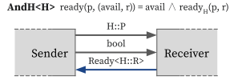
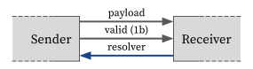

# Interface

Interface is a communication protocol between modules.
HazardFlow HDL provides a **Hazard** that abstracts communication protocol with arbitrary transfer conditions (e.g., valid-ready protocol).
Like signals, interfaces also support compound types such as tuples and structs.

<!-- Hazard and interface are the most fundamental concepts of the HazardFlow HDL.
We define a `struct` implementing the `Interface` trait and containing the `Hazard` as a **Hazard Interface**, the building block for describing hardware behavior. -->

## Hazard

### Motivation: Handshake

In hardware semantics, a communication protocol is described as a handshake mechanism.

As an example, the most commonly used valid-ready protocol is described as below:

<p align="center">
  
</p>

- The sender generates a 1-bit valid signal and a payload signal every clock cycle.
- The receiver generates a 1-bit ready signal each clock cycle.
- A **transfer** occurs when both the valid and ready signals are asserted (i.e., both are true).
- It's important to note that the payload is continuously present on the wire, regardless of the valid or ready signals.

Example waveform:

<p align="center">
  
</p>

<!--
{
  signal: [
    {name: 'clk', wave: 'p...'},
    {name: 'valid', wave: '01.0'},
    {name: 'payload', wave: 'x3.x', data: ['0x42']},
    {name: 'ready', wave: '0.10'}
  ],
  head: {
    tock:0,
    every:1
  }
}
-->

- At cycle 1, the sender turns on the valid bit with payload `0x42`.
  - Transfer does not happen because the receiver is not ready.
- At cycle 2, the receiver turns on the ready bit.
  - Transfer happens because both the valid and ready signals are true.

### Specification

In HazardFlow HDL, we abstracted any arbitraty communication protocol into `Hazard` trait.
It describes the necessary information for communication: payload, resolver, and ready function.

```rust,noplayground
pub trait Hazard {
    type P: Copy;
    type R: Copy;

    fn ready(p: Self::P, r: Self::R) -> bool;
}
```

For any hazard type `H`, its member type and functions have the following meaning:

- `H::P`: Payload signal type.
- `H::R`: Resolver signal type.
- `H::ready`: Returns if the receiver is ready to receive with the current payload and resolver pair.

### Examples

We provide a few handy primitive hazard interfaces for developers.

#### `ValidH`

<p align="center">
  
</p>

`ValidH` represents a communication without backpressure (always ready to receive).

It has the following specification:

```rust,noplayground
struct ValidH<P: Copy, R: Copy>;

impl<P: Copy, R: Copy> Hazard for ValidH<P, R> {
    type P = P;
    type R = R;

    fn ready(p: P, r: R) -> bool {
        true
    }
}
```

For reusability, we added additional resolver signals that simply flow from the receiver to the sender.

#### `AndH`

<p align="center">
  
</p>

For a given hazard specification `H`, the conjunctive `AndH<H>` specification adds to `H`'s resolver signal an availability bit flag.
Then the receiver is ready if it is available and ready according to the internal specification `H` at the same time.

<!-- We define an **And** hazard `AndH<H: Hazard>`, whose resolver type is `Ready<H::R>`.
`Ready<R>` is a `struct` containing both a resolver and a ready signal in HazardFlow HDL. -->

```rust,noplayground
struct AndH<H: Hazard>;

struct Ready<R: Copy> {
    ready: bool,
    inner: R,
}

impl<H: Hazard> Hazard for AndH<H> {
    type P = H::P;
    type R = Ready<H::R>;

    fn ready(p: H::P, r: Ready<H::R>) -> bool {
        r.ready && H::ready(p, r.inner)
    }
}
```

The `ready` field of the `Ready` struct represents the availability of the receiver.

#### `VrH`

<p align="center">
  
</p>

We defined the valid-ready hazard `VrH<P, R>` as `AndH<ValidH<P, R>>`.

```rust,noplayground
type VrH<P: Copy, R: Copy> = AndH<ValidH<P, R>>;
```

For reusability, we added additional resolver signals that simply flow from the receiver to the sender.

<!-- * The payload type of the Valid-Ready Interface is `HOption<P>`.
* The resolver type of the Valid-Ready Interface is `Ready<()>`.
* When the payload is valid, which means the payload is `Some(P)`, and the ready signal in the resolver is `true`, then transfer happens.
* Specially, we define the Valid-Ready Interface as `pub type Vr<P, const D: Dep = { Dep::Helpful }> = I<VrH<P>, D>` -->

## Interface

An interface is an abstraction that represents the IO of a hardware module.

Typically, a single interface is composed of zero, one, or multiple hazard interfaces.

### Specification

```rust,noplayground
pub trait Interface {
    type Fwd: Copy;
    type Bwd: Copy;

    ...
}
```

For any interface type `I`, its member types have the following meaning:

- `I::Fwd`: Forward signal type.
- `I::Bwd`: Backward signal type.

It contains the other methods related to the [module](./module.md) and [combinator](./combinator.md), please refer to these sections for further reading.

<!-- We define the interface as a protocol with forward signal, backward signal, and some other methods.
The other methods are related to the [combinator](./combinator.md) and [module](./module.md), please refer to the corresponding section. -->

### Hazard Interface

<p align="center">
  
</p>

For an arbitraty hazard specification `H`, we define the hazard interface `I<H, D>`, where `D` is the dependency type. (For more information of the dependency, please refer to the [dependency section](../advanced/dependency.md))

<!-- If a `struct` implements the interface trait and also contains a hazard, we consider it as a **hazard interface**. In the HazardFlow HDL, we define it as `I<H, D>`, where `H` is the hazard, and `D` is the dependency type of hazard protocol. For more information of the dependency, please refer to the [dependency section](../advanced/dependency.md). -->

```rust,noplayground
pub struct I<H: Hazard, D: Dep>;

impl<H: Hazard, const D: Dep> Interface for I<H, D> {
    type Fwd = HOption<H::P>,
    type Bwd = H::R,
}
```

- The interface's forward signal is an `HOption` type of hazard payload. 
- The backward signal is the hazard's resolver.
- When the forward signal is `Some(p)` means the sender is sending a valid payload, else it is sending an invalid payload signal. 
- When we have `payload.is_some_and(|p| H::ready(p, r))`, the transfer happens.

We define `Valid` and `Vr` as the hazard interface types for `ValidH` and `VrH`, respectively.

```rust,noplayground
type Valid<P> = I<ValidH<P, ()>, { Dep::Helpful }>;
type Vr<P> = I<VrH<P, ()>, { Dep::Helpful }>;
```

### Compound Interface

Compound types such as tuple, struct, and array also implement the `Interface` trait.

These interfaces are commonly used for IO of [1-to-N](combinator.md#1-to-n) or [N-to-1](combinator.md#n-to-1) combinators.

#### Tuple

Tuple of interfaces `(If1, If2)` implements `Interface` trait as follows:

```rust,noplayground
// In practice, it is implemented as a macro.
impl<If1: Interface, If2: Interface> Interface for (If1, If2) {
    type Fwd = (If1::Fwd, If2::Fwd);
    type Bwd = (If1::Bwd, If2::Bwd);
}
```

- The forward signal of the array interface is the tuple of the interfaces' forward signals.
- The backward signal of the array interface is the tuple of the interfaces' backward signals.

#### Struct

```rust,noplayground
#[derive(Debug, Interface)]
struct<If1: Interface, If2: Interface> StructIf<If1, If2> {
    i1: If1,
    i2: If2,
}
```

By applying the `Interface` derive macro to a struct in which all fields are interface type, the struct itself can also become an interface type.

#### Array

Array of interfaces `[If; N]` also implements `Interface` trait as follows:

```rust,noplayground
impl<If: Interface, const N: usize> Interface for [If; N] {
    type Fwd = Array<If::Fwd, N>;
    type Bwd = Array<If::Bwd, N>;
}
```

- The forward signal of the array interface is the array of the interfaces' forward signal.
- The backward signal of the array interface is the array of the interfaces' backward signal.
