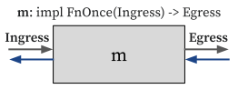

# Modules

<!-- Modules help structure the design of complex hardware systems, like processors, by breaking them into smaller, manageable, and reusable components. -->

In Rust, the [`FnOnce` trait](https://doc.rust-lang.org/stable/std/ops/trait.FnOnce.html) is automatically implemented for types that can be called once. For example, the primitive function `fn(i: Ingress) -> Egress` and closures that might consume captured variables (`|i: Ingress| -> Egress { .. }`) implements `FnOnce(Ingress) -> Egress` trait.

And in HazardFlow, we treat a function `m` that implements the `FnOnce(Ingress) -> Egress` trait where `Ingress` and `Egress` implement the [`Interface` trait](interface.html#interface-1) as a module with `Ingress` as its ingress interface and `Egress` as its egress interface.

<p align="center">
  
</p>

The common way to construct a module is chaining interface combinators.
Please refer to the [Interface Combinators](./combinator.md) for more information.

### Example: FIR Filter

In the [tutorial](../tutorial/fir_filter.html#implementation), the FIR filter module was implemented as follows:

```rust
fn fir_filter(input: Valid<u32>) -> Valid<u32> {
    let weight = Array::<u32, 3>::from([4, 2, 3]);

    input
        .window::<3>()
        .map(|ip| ip.zip(weight).map(|(e, wt)| e * wt))
        .sum()
}
```

The `fir_filter` function implements `FnOnce(Valid<u32>) -> Valid<u32>`, so we can treat it as a module with `Valid<u32>` as both its ingress and egress interface.

## Module Combinators

We provide some convenient module combinators that take a module, modify it, and return a new module.

### `seq`

Generates a 1D systolic array from an array of modules.

```rust
fn seq<I: Interface, O: Interface, J: Interface, const N: usize>(
    ms: [fn(I, J) -> (O, J); N],
) -> impl FnOnce([I; N], J) -> ([O; N], J)
```

You can construct an array of modules explicitly from elements, or if all the modules have the same behavior, you can use the [`from_fn` API](https://kaist-cp.github.io/hazardflow/docs/hazardflow_designs/std/module/fn.from_fn.html#).

### `flip`

Flips a module's input and output.

```rust
fn flip<I1: Interface, I2: Interface, O1: Interface, O2: Interface, T>(
    f: T
) -> impl FnOnce(I2, I1) -> (O2, O1)
where
    T: FnOnce(I1, I2) -> (O1, O2),
```
