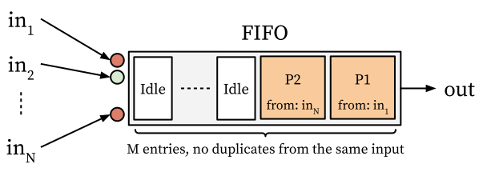
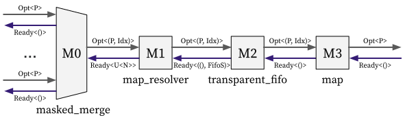
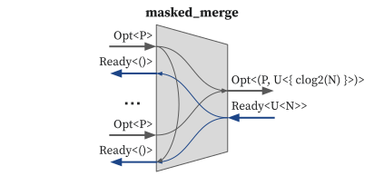

# FIFO without duplication

In this tutorial, we will implement a custom FIFO which can be used to provide balanced transfers for multiple input streams, thereby offering balanced latency for each input stream.

## Specification

The custom FIFO with and *N* input streams and *M* entries performs the following operation:

<center></center>

It has *M* entries and receives payloads from *N* input streams.
The key point is that it does not accept payloads from an input stream that already has an entry in the FIFO.

For example, in the figure above, the FIFO contains P1 and P2, which are payloads received from the `in_1` and `in_N`, respectively.
Therefore, the next payload will be accepted from an input stream other than `in_1` and `in_N`.
`in_1` and `in_N` become selectable again after P1 and P2 are removed from the FIFO via output
(the circles in front of the FIFO indicates whether each input stream can be received; a red circle means cannot, a green circle means can).

## Modular Design

We could represent the custom FIFO in modular way as follows (`U<M>` is a bitvector of width `M`):

<p align="center">
  
</p>

**`masked_merge` submodule:**

<!--
In this example, a FIFO is placed after `masked_merge` to track which ingress interface the recent transfers occurred on.
This information is used to prevent consecutive selections from the same ingress interface.
-->

<!--
The `masked_merge` combinator performs the following operation (`U<M>` is a bitvector of width `M`):

<p align="center">
  
</p>
-->

<!-- TODO: to explain masked merge, we don't need to think of FIFO queue. It can be an example of using masked merge, but the current text *assumes* there should be a FIFO queue: "It indicates which ingress interfaces are present in the current queue." -->

- It takes N valid-ready interfaces (`Vr<P>` = `I<VrH<P, ()>`, `VrH` is defined in [here](../lang/interface.md#vrh)).
- It returns a valid-ready hazard interface (`I<VrH<(P, U<{ clog2(N) }>), U<N>>>`).
  + The `U<{ clog2(N) }>` in the payload indicates the index of selected ingress interface.
  + The `U<N>` in the resolver indicates the mask bits for the selection.
- It will select from the ingress interface which has valid payload with the mask bit has `false`.
  + For example, if `N` is 4 and the mask bits are `[true, true, false, true]`, then it will try to select from the third ingress interface.
  + If multiple ingress interfaces are selectable, the one with the smallest index is chosen.
  + In this example, the mask bits means the origin of the current payloads in the FIFO.

<!-- * We can think of a valid-ready Interface as a valid interface `Valid<P>` with an extra ready signal (Boolean value) in its resolver. -->
<!-- * The transfer happens only when the payload is `Some(P)`, and the ready signal in the resolver is `true`. -->
<!-- * We can represent the ingress interface type as `[Vr<u32>; N]`. -->
<!-- * For more information about the valid-ready interface please refer to the [valid-ready interface](../lang/interface.md#vrh). -->
<!-- * For more information about the compound interface type, please refer to the [compound interface section](../lang/interface.md#compound-interface). -->
<!--
The Masked Merge combinator egress interface is also a valid-ready hazard interface `I<Self::EH, { Dep::Demanding }>`.
* We define the egress hazard as `type EH = VrH<(P, U<{ clog2(N) }>), Array<bool, N>>`.
  * The payload type is a tuple type.
    * `Option<P>` contains the real data we want to send through the wires.
    * `U<{ clog2(N) }>` is the index of the ingress interfaces represented in bits. `clog2(N)` is the bit-width for representing integer `N`.
    * The payload will be sent to the FIFO queue. 
    * The element in the FIFO queue is a tuple containing the actual data and the index of the ingress interface that sends the data.
  * The resolver is an array of `bool` of size `N`.
    * This resolver is sent back from the FIFO queue.
    * It indicates which ingress interfaces are present in the current queue.
    * If there are 4 ingress interfaces and the array is `[true, false, false, true]`, it indicates the ingress interface 1's and ingress interface 2's payloads are not currently in the queue.
-->

<!--
- It selects one of the ingress interfaces to transfer its payload to the next combinator.
- The selection is based on the mask bits (`U<N>`) from the egress resolver.
- If multiple ingress interfaces are selectable, the one with the smallest index is chosen.
-->

**`map_resolver` submodule:**

- It transforms the inner resolver signal from the FIFO state (`FifoS`) to the mask bits (`U<N>`).
  + `FifoS` indicates the current state of the FIFO, including elements and head/tail indices.
  + The `i`-th element of mask bits (`U<N>`) indicates that one of the payload currently in the FIFO has been selected from the `i`-th ingress interface of `M0`.
- It does not touch the forward signals and the ready signal.
<!--
- The `U<N>` indicates which ingress interfaces are present in the current FIFO.
-->

**`transparent_fifo` submodule:**

- It takes a payload from the ingress interface when the FIFO is not full.
- It returns the oldest payload in the FIFO to the egress interface.
- It sends the FIFO's fullness (`Ready`) and the current FIFO state (`FifoS`) as the ingress resolver.

<!-- The FIFO Queue ingress interface:
* The payload is a tuple containing the actual data we want to transfer and also the index of the ingress interface of the Masked Merge combinator that sends the data.
* The resolver indicates which ingress interfaces are present in the current queue.

The FIFO Queue egress interface is a simple valid-ready interface `Vr<P>`. -->

**`map` submodule:**

- It drops the unnecessary index information in the payload.

## Implementation

Based on the above submodules, we can implement the custom FIFO in a concise and modular way:

```rust,noplayground
fn custom_fifo(ingress: [Vr<u32>; N]) -> Vr<u32> {
    ingress
        .masked_merge()
        .map_resolver_inner::<FifoS<(u32, U<{ clog2(N) }>), M>>(|fifo_s| {
            fifo_s.inner_with_valid().fold(false.repeat::<N>(), |acc, i| {
                if let Some((_, idx)) = i {
                    acc.set(idx, true)
                } else {
                    acc
                }
            })
        })
        .transparent_fifo()
        .map(|(ip, _idx)| ip)
}
```

- We used `u32` for the payload type, `N` for the number of ingress interfaces and `M` for the FIFO size.
- `fifo_s.inner_with_valid()` represents the inner elements of the FIFO.
  + It has type `Array<HOption<u32>, M>`, `HOption` represents the validity of the element.
- We `fold` the inner elements of the FIFO in the `map_resolver_inner` combinator:
  + The initializer is a boolean array with all elements as `false` of size `N`
  + The index of the initializer array indicates the index of the ingress interfaces.
  + We iterate through all the elements within the FIFO and set the accumulator's value at the index in each FIFO element to `true`.
  + The final result indicates which ingress interfaces are present in the current FIFO.
- We send back this resolver to the `masked_merge` combinator to make decision for choosing the next ingress interface.
- We filter out the unnecessary index information in the last `map` combinator.
- The implementation of the `masked_merge()` combinator will be explained in the [Implementing Combinators](../advanced/combinator.md) section.

You can find the full implementation in [custom_fifo.rs](https://github.com/kaist-cp/hazardflow/blob/main/hazardflow-designs/src/examples/custom_fifo.rs).

You can generate the Verilog codes with the following commands:

```bash
# Generate a separate Verilog file for each submodule.
$ cargo run --release -- --target custom_fifo --deadcode --wire-cache

# Generate an integrated Verilog file combining all submodules.
$ cargo run --release -- --target custom_fifo --deadcode --wire-cache --merge
```

---

Congratulations! You finished the tutorial!
