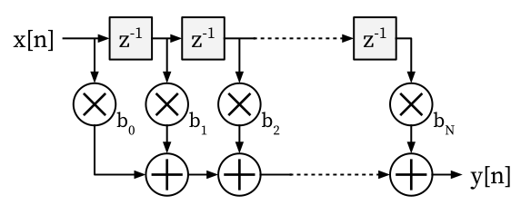
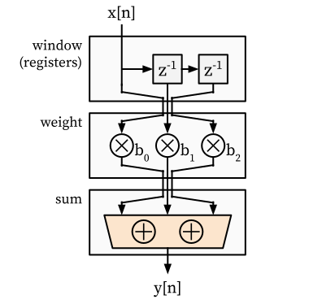

# FIR Filter

In this tutorial, we will use HazardFlow HDL to describe an [FIR (finite impulse response) filter](https://en.wikipedia.org/wiki/Finite_impulse_response), which is very commonly used in digital signal processing applications.

## Specification

The FIR filter of order *N* performs the following operation:

<center></center>

It receives input signals from the stream *x* and outputs the weighted sum of the most recent *N+1* input signals to the stream *y*.
It can be expressed with the following formula:

<center></center>

where  and  represent the input and output signals,  represents the filter order, and  represents the *i*-th filter coefficient.

For example, the IO signals of a FIR filter of order 2 with coefficients [4, 2, 3] are as follows:

| n   | x[n] | y[n]                 |
| --- | ---- | -------------------- |
| 0   | 1    | 4·1 + 2·0 + 3·0 = 4  |
| 1   | 4    | 4·4 + 2·1 + 3·0 = 18 |
| 2   | 3    | 4·3 + 2·4 + 3·1 = 23 |
| 3   | 2    | 4·2 + 2·3 + 3·4 = 26 |
| 4   | 7    | 4·7 + 2·2 + 3·3 = 41 |
| 5   | 0    | 4·0 + 2·7 + 3·2 = 20 |

For more details, please refer to [Wikipedia](https://en.wikipedia.org/wiki/Finite_impulse_response).

## Modular Design

We could represent the FIR filter of order 2 in modular way as follows:

<center></center>

As in the above figure, it can be divide into 3 submodules: `window`, `weight`, and `sum`.

**`window` submodule:**

* It serves as a sliding window, always returning the latest 3 valid input signals as an array.
* For example, if 1, 4, 3 are given as input signals, `[1, 0, 0]`, `[4, 1, 0]`, `[3, 4, 1]` will be returned as output signals.
<!-- * If input signal is invalid at a certain cycle, it will be ignored. -->

**`weight` submodule:**

* It keeps the weight vector `[b0, b1, b2]` persistent throughout the program.
* It takes the input vector `[v0, v1, v2]` and returns the output vector `[b0·v0, b1·v1, b2·v2]`.

**`sum` submodule:**

* It takes the input vector and returns the sum of them as an output vector.

## Implementation

Based on the above submodules, we can implement the FIR filter in a concise and modular way:

```rust,noplayground
fn fir_filter(input: Valid<u32>) -> Valid<u32> {
    input
        .window::<3>()
        .weight([4, 2, 3])
        .sum()
}
```

We can describe the FIR filter with `window`, `weight`, and `sum` combinators in the HazardFlow HDL and we assume the input interface `Valid<u32>` is provided.
`Valid<u32>`, which is an alias of [`I<ValidH<u32, ()>>`](../lang/interface.md#validh) is a **valid interface** where its payload is `u32`, the resolver is empty `()`, and its `ready` function always returns `true`.
In other words, as long as the input interface's forward signal is `Some(u32)` at a specific clock cycle, the receiver receives a valid payload.
We can interpret this input interface as a stream of signal values flowing through the wires.

**`window` combinator:**

The `window` combinator is defined as follows:

```rust,noplayground
impl<P: Copy + Default> Valid<P> {
    fn window<const N: usize>(self) -> Valid<Array<P, N>> {
        self.fsm_map(P::default().repeat::<N>(), |ip, s| {
            let ep = s.append(ip.repeat::<1>()).clip_const::<N>(0);
            let s_next = ep;
            (ep, s_next)
        })
    }
}
```

It takes an `Valid<P>` and returns `Valid<Array<P, N>>`.
It tracks the latest `N` valid input signals.
The [`fsm_map` interface combinator](https://kaist-cp.github.io/hazardflow/docs/hazardflow_designs/std/hazard/struct.I.html#method.fsm_map) is provided by the HazardFlow HDL standard library.
It transforms the ingress payload to the egress payload, calculates the next state for the next clock cycle, and leaves the resolver signal untouched.
It takes an initial state, and an anonymous function, and returns a new interface.
The initial state is defined as `P::default().repeat::<N>()` in our example.
The anonymous function is where we specify the fsm logic from the `(ingress payload, current state)` to the `(egress payload, next state)`.

<!-- 
* Ingress interface is `Valid<P>`.
* Egress interface is `Valid<Array<P, N>>`, where `N` is the size of the FIR filter.
* It should have a state to keep tracking of the latest valid input and return the latest `N` valid values every clock cycle. -->

<!-- * `impl<P: Copy + Default> Valid<P>` is how we define a custom combinator for the input interface `Valid<P>`, where `P` should be able to be copied and should have a default value.
* Then we define the `window` combinator as `pub fn window<const N: usize>(self) -> Valid<Array<P, N>>`, where `N` is the size of the FIR filter, and the egress interface's type is `Valid<Array<P, N>>`. -->
<!-- * The egress interface's payload is `Option<Array<P, N>>`, an optional type of array with `P` type elements, and the array size is `N`. The resolver is empty `()`. -->
<!-- * The anonymous function takes the ingress payload and the current state as inputs and returns the egress payload and next state.
  * The `append` function concats two arrays together.
  * The `ip.repeat::<1>()` function transforms `ip` into an array of one element `ip`.
  * The `clip_const::<N>(0)` function clips the array from index 0 of size `N`.
  * Note that in HazardFlow HDL, the array index is in descending order from left to right, for more details please refer to the [signal](./signal.md) section. -->

**`weight` combinator:**

The `weight` combinator is defined as follows:

```rust,noplayground
impl<const N: usize> Valid<Array<u32, N>> {
    fn weight(self, weight: [u32; N]) -> Valid<Array<u32, N>> {
        self.map(|ip| ip.zip(weight).map(|(ele, weight)| ele * weight))
    }
}
```

It takes an `Valid<Array<u32, N>>` and returns an egress hazard interface `Valid<Array<u32, N>>`.
It transforms the `i`-th element of ingress payload `ip[i]` into `weight[i] * ip[i]`, and leaves the resolver as untouched.
The [`map` interface combinator](https://kaist-cp.github.io/hazardflow/docs/hazardflow_designs/std/hazard/struct.I.html#method.map) is provided by the HazardFlow HDL standard library.
We can interpret it as stateless version of `fsm_map`.
In the application-specific logic in `map` interface combinator, we use `zip` and `map` methods for manipulating the ingress payload signal.

<!-- It takes an `Valid<Array<u32, N>>` and returns another `Valid<Array<u32, N>>`. -->
<!-- 
* `impl<const M: usize, const N: usize> Valid<Array<U<M>, N>>` is how we define a custom combinator for the input interface `Valid<Array<U<M>, N>>`. -->
<!-- * The `map` combinator is a primitive combinator provided by the HazardFlow HDL standard library.
The anonymous function transforms the ingress payload to the egress payload in the same clock cycle.
We can interpret it as `fsm_map` with the `()` state. -->
<!-- * `zip` function zips two `Array` together and returns new `Array` that has tuples from two given arrays as elements.
* We use `map` combinator again to multiply two elements from the tuple and return the egress payload. -->

**`sum` combinator:**

The `sum` combinator is defined as follows:

```rust,noplayground
impl<const N: usize> Valid<Array<u32, N>> {
    fn sum(self) -> Valid<u32> {
        self.map(|ip| ip.fold_assoc(|e1, e2| e1 + e2))
    }
}
```

It takes an `Valid<Array<u32, N>>` and returns `Valid<u32>`.
It transforms the ingress payload to sum of them.
In the application-specific logic in `map` interface combinator, we use `fold_assoc` method which aggregates the data within array of signal.

You can find the implementation in [fir_filter.rs](https://github.com/kaist-cp/hazardflow/blob/main/hazardflow-designs/src/examples/fir_filter.rs).
