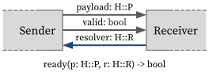

# Tutorial

We will introduce some basic concepts in the HazardFlow HDL programming model and use HazardFlow HDL to describe an [FIR (finite impulse response) filter](https://en.wikipedia.org/wiki/Finite_impulse_response) and a masked merge combinator.

HazardFlow HDL's implementation is based on the concept of [hazard interface](../lang/interface.md). <!-- and [combinator](./module.md).  -->
We will give a brief explanation here about the interface and combinator for you to understand how to use them to implement the FIR filter and fair multiplexer.
For more details please refer to the [Concepts](../lang/concepts.md) section.

### Hazard Interface

In HazardFlow HDL, we define the hazard as a protocol including the payload, resolver, and ready condition.
We model the hazard interface as a structure containing its forward signal, backward signal, and the ready condition specified by its hazard.
We define the hazard protocol as `H`, its payload and resolver as `H::P` and `H::R` respectively.

<p align="center">
  
</p>

```rust,noplayground
// Hazard specification.
trait Hazard {
    type P: Copy;
    type R: Copy;

    fn ready(p: Self::P, r: Self::R) -> bool;
}

// Hazard interface.
struct I<H: Hazard>;

impl<H: Hazard> Interface for I<H> {
    type Fwd = Option<H::P>,
    type Bwd = H::R,
}
```

**Forward signal:** the payload of the interface
* It is the data will be sent from the sender to the receiver.
* We define it as an `Opt<H::P>` type. When it is `Some(p)`, the sender is sending a valid payload, else it is sending an invalid payload.

**Backward signal:** the resolver of the interface
* It represents the hazard generated by the later stage from the circuits and it will be sent from the receiver to the sender.
* We define the resolver signal as `H::R`

**Ready condition:** the indicator whether the receiver is ready to receive the payload
* We define the ready condition as `fn ready(p: Self::P, r: Self::R) -> bool;` where the `p` is the payload and `r` is the resolver.
* When the forward signal is `Some(p)`, which means the forward signal is valid, **and** the ready condition returns `true`, which means the receiver is ready to receive the valid payload, then the transfer happens.
* When the forward signal is `None`, which means the forward signal is invalid, **or** the ready condition returns `false`, which means the receiver is not ready to receive the valid payload, then the transfer is not happening.

<!-- For more details, please refer to the [Interfaces](../lang/interface.md) section. -->

### Module

A module has a state of type `S` and ingress and egress hazard interface types, say `IH` and `EH`.

Conceptually, the module's behavior can be represented as a function of the following signature:

<p align="center">
  
</p>

```rust,noplayground
comb: impl Fn(Option<IH::P>, EH::R, S) -> (Option<EH::P>, IH::R, S)
```

It takes three input signals:

- Ingress interface's forward signal (`Option<IH::P>`)
- Egress interface's backward signal (`EH::R`)
- Current state (`S`)

and returns three output signals:

- Egress interface's forward signal (`Option<EH::P>`)
- Ingress interface's backward signal (`IH::R`)
- Next state (`S`)

Here, `Option<H::P>` is `Some` is the payload is *valid*; otherwise it's `None`.

<!-- TODO: a simple figure is necessary. -->

<!-- For more details, please refer to the [Modules](../lang/module.md) section. -->

### Combinator

Combinator is the idiomatic mechanism of attaching a module to an interface.

<p align="center">
  
</p>

<!-- TODO: I think the figure is wrong. The figure seems like all combinators are no-op. Can you add some combinational cloud and states to represent proper sequential logic? -->

We define a combinator as a function `fsm` within each hazard interface in the HazardFlow HDL and it will be called each clock cycle:

```rust,noplayground
impl<IH: Hazard> I<IH> {
    fn fsm<S: Copy, EH: Hazard>(
        self,
        init_state: S,
        f: impl Fn(Option<IH::P>, EH::R, S) -> (Option<EH::P>, IH::R, S),
    ) -> I<EH> {
        ..
    }
}
```

<!-- TODO: dependence is not introduced in this document, right? then explicitly mention "don't care about it now." -->

<!-- TODO: change the following paragraph as if we're explaining the signature of the above function. -->

It specifies the type of ingress, egress, and state.

- Ingress hazard interface type (`IH`)
- Egress hazard interface type (`EH`)
- State type (`S`)

Also, it accepts two arguments for representing the module's behavior:

- Initial state when reset happened (`init_state`)
- Combinational logic of the module's behavior (`f`)

<!-- We define the hazard type for the ingress interface as `H` and `EH` for the egress interface. -->

<!--
**Ingress payload:** the forward signal of the ingress interface
* It is considered as a given input and it will be taken as an argument for the anonymous function.

**Egress resolver:** the backward signal of the egress interface
* It is considered as a given input and it will be taken as an argument for the anonymous function.

**Egress payload:** the forward signal of the egress interface
* This signal will be calculated within the anonymous function.
* This signal will be sent as the payload to the next combinator.

**Ingress resolver:** the backward signal of the ingress interface
* This signal will be calculated within the anonymous function.
* This signal will be sent as the resolver to the previous combinator.

**State:** the register status within the combinator
* The current state of the combinator will be taken as an argument for the anonymous function.
* The next state of the combinator will be calculated within the anonymous function.

**The sequential logic:**
* This is the function we used to update the payload to the next combinator, resolver for the previous combinator, and the next state of the current combinator.
* We can ignore the `Dep` and `unsafe` for now.
-->

HazardFlow HDL provide standard combinator library for developers to facilitate their work.

For more details, please refer to the [Interface Combinators](../lang/combinators.md) section.
