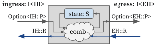

# Tutorial

We will introduce some basic concepts in the HazardFlow HDL programming model and use HazardFlow HDL to describe an [FIR (finite impulse response) filter](https://en.wikipedia.org/wiki/Finite_impulse_response) and a custom FIFO which does not allow duplicated entries.

HazardFlow HDL's implementation is based on the concept of [hazard interface](../lang/interface.md).
Here, we will provide a brief overview of the interface and combinator to help you understand how to use them for implementing hardware modules.
For more details, please refer to the [Concepts](../lang/concepts.md) section.

## Hazard Interface

In HazardFlow HDL, a "hazard protocol" is defined as a communication protocol that includes a payload, a resolver, and a ready condition.
For a given hazard protocol `H`, its payload, resolver, and ready condition are represented as `H::P`, `H::R`, and `H::ready`, respectively.

The hazard interface is defined as `I<H>` for a given hazard protocol `H`.
It will be used as an ingress or egress type for the module.

<p align="center">
  
</p>

```rust,noplayground
// Hazard protocol.
trait Hazard {
    type P: Copy;
    type R: Copy;

    fn ready(p: Self::P, r: Self::R) -> bool;
}

// Hazard interface.
struct I<H: Hazard>;
```

**Forward signals**: the payload of the interface and its validity.

- The payload signal (`H::P`) is data sent from the sender to the receiver.
- The valid signal (`bool`) represents the validity of the payload signal.
<!--
- We define it as an `Option<H::P>` type. When it is `Some(p)`, the sender is sending a valid payload, else it is sending an invalid payload.
-->

**Backward signal:** the resolver of the interface.

- The resolver signal (`H::R`) is data sent from the receiver to the sender. It includes information used to control transferability (e.g., the receiver cannot accept the incoming payload for now).
<!--
- It represents the hazard generated by the later stage from the circuits and it will be sent from the receiver to the sender.
-->

**Ready condition:** the indicator whether the receiver is ready to receive the payload.

- The ready condition (`H::ready`) returns if the receiver is ready to receive with the current payload and resolver pair.
- Logically, we say **"transfer occurs"** when the valid signal is `true` and the ready condition is `true`, which means the receiver is ready to receive the valid payload from the sender.
<!--
- We define the ready condition as `fn ready(p: Self::P, r: Self::R) -> bool;` where the `p` is the payload and `r` is the resolver.
- When the valid signal is `true` **and** the ready condition returns `true` (= the receiver is ready to receive the valid payload), then the transfer occurs.
- When the valid signal is `false`, **or** the ready condition returns `false`, which means the receiver is not ready to receive the valid payload, then the transfer is not happening.
-->

### Example: valid-ready protocol

The [valid-ready protocol](../lang/interface.md#motivation-handshake), which is the most commonly used protocol for communication between modules in hardware, can be represented as follows.

<p align="center">
  
</p>

```rust,noplayground
struct ExampleVrH;

impl Hazard for ExampleVrH {
    type P = u32;
    type R = bool;

    fn ready(p: u32, r: bool) -> bool {
        r
    }
}
```

## Module

A module has a state of type `S` and ingress and egress hazard interface types, `I<IH>` and `I<EH>`.

<p align="center">
  
</p>

Conceptually, the module's behavior can be represented as a function of the following signature:

<p align="center">
  
</p>

```rust,noplayground
comb: impl Fn(Option<IH::P>, EH::R, S) -> (Option<EH::P>, IH::R, S)
```

It takes three input signals:

- Ingress interface's forward signal (`Option<IH::P>`)
- Egress interface's backward signal (`EH::R`)
- Current state (`S`)

and returns three output signals:

- Egress interface's forward signal (`Option<EH::P>`)
- Ingress interface's backward signal (`IH::R`)
- Next state (`S`)

Here, the forward signals are abstracted as `Option<H::P>`, where `Some(p)` indicates that the valid signal is `true` and the payload signal is `p`, while `None` indicates that the valid signal is `false`.

<!-- Here, `Option<H::P>` is `Some` is the payload is *valid*; otherwise it's `None`. -->

*NOTE*: A module can have zero or multiple hazard interfaces for its ingress or egress.
For more details, please refer to the [Interfaces](../lang/interface.md#interface-1) section.

## Combinator

Combinator is the idiomatic mechanism of attaching a module to an interface.

<!--
<p align="center">
  
</p>
-->

We define the generic combinator as a function `fsm` within each hazard interface in the HazardFlow HDL and it will compute the combinational logic each cycle:

```rust,noplayground
impl<IH: Hazard> I<IH> {
    fn fsm<S: Copy, EH: Hazard>(
        self,
        init_state: S,
        comb: impl Fn(Option<IH::P>, EH::R, S) -> (Option<EH::P>, IH::R, S),
    ) -> I<EH> {
        ..
    }
}
```

<!-- TODO: dependence is not introduced in this document, right? then explicitly mention "don't care about it now." -->

<!-- TODO: change the following paragraph as if we're explaining the signature of the above function. -->

It specifies the state type and ingress and egress interface types.

- State type (`S`)
- Ingress hazard interface type (`I<IH>`)
- Egress hazard interface type (`I<EH>`)

Also, it accepts two arguments for representing the module's behavior:

- Initial state when the circuit is reset (`init_state`)
- Combinational logic representing the module's behavior (`comb`, as illustrated in the above)

<!-- We define the hazard type for the ingress interface as `H` and `EH` for the egress interface. -->

<!--
**Ingress payload:** the forward signal of the ingress interface
* It is considered as a given input and it will be taken as an argument for the anonymous function.

**Egress resolver:** the backward signal of the egress interface
* It is considered as a given input and it will be taken as an argument for the anonymous function.

**Egress payload:** the forward signal of the egress interface
* This signal will be calculated within the anonymous function.
* This signal will be sent as the payload to the next combinator.

**Ingress resolver:** the backward signal of the ingress interface
* This signal will be calculated within the anonymous function.
* This signal will be sent as the resolver to the previous combinator.

**State:** the register status within the combinator
* The current state of the combinator will be taken as an argument for the anonymous function.
* The next state of the combinator will be calculated within the anonymous function.

**The sequential logic:**
* This is the function we used to update the payload to the next combinator, resolver for the previous combinator, and the next state of the current combinator.
* We can ignore the `Dep` and `unsafe` for now.
-->

For reusability, HazardFlow HDL provides a standard combinator library for developers.
It defines many useful combinators (e.g., `filter_map`, `mux`, etc.), which are implemented as wrapper functions for generic FSM combinator.
For more details, please refer to the [Interface Combinators](../lang/combinator.md#standard-combinator-library) section.
